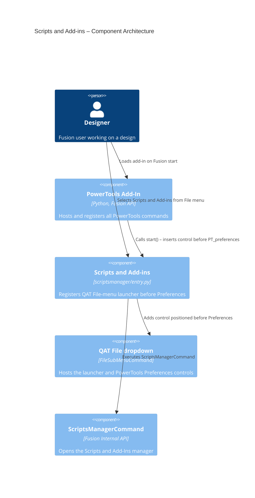

# Scripts and Add-ins — Architecture

[← Scripts and Add-ins guide](../Scripts%20and%20Add-ins.md)

## Architecture

The Scripts and Add-ins command registers a single button control in the QAT
File dropdown (`FileSubMenuCommand`) and positions it directly before the
PowerTools Preferences control (`PT_preferences`). It is a launcher: on
execution it dispatches to the built-in Fusion `ScriptsManagerCommand` and
terminates immediately, presenting no dialog of its own.

Because the Preferences command is infrastructure that always starts first (see
`commands/__init__.py`), the `PT_preferences` anchor exists by the time this
command's `start()` runs. If the anchor is ever missing, `start()` falls back to
appending the control to the dropdown.

The command is registered under the **Tools** group in `command_registry.py`, so
it can be enabled or disabled from the **Tools** section of PowerTools
Preferences. When disabled, the start-up gating in `commands/__init__.py` skips
its `start()` and the menu item is not added.

### Command ID

`PT_scriptsmanager` (launches built-in `ScriptsManagerCommand`)

### Execution flow

1. The add-in registers the command definition and inserts a control in the QAT
   File dropdown, positioned before `PT_preferences`.
2. The user selects **Scripts and Add-ins** from the File menu.
3. The `command_created` handler resolves `ScriptsManagerCommand` by ID.
4. If found, it calls `execute()` to open the built-in Scripts and Add-Ins
   manager; otherwise it shows a message that the manager is unavailable.

### Component diagram

