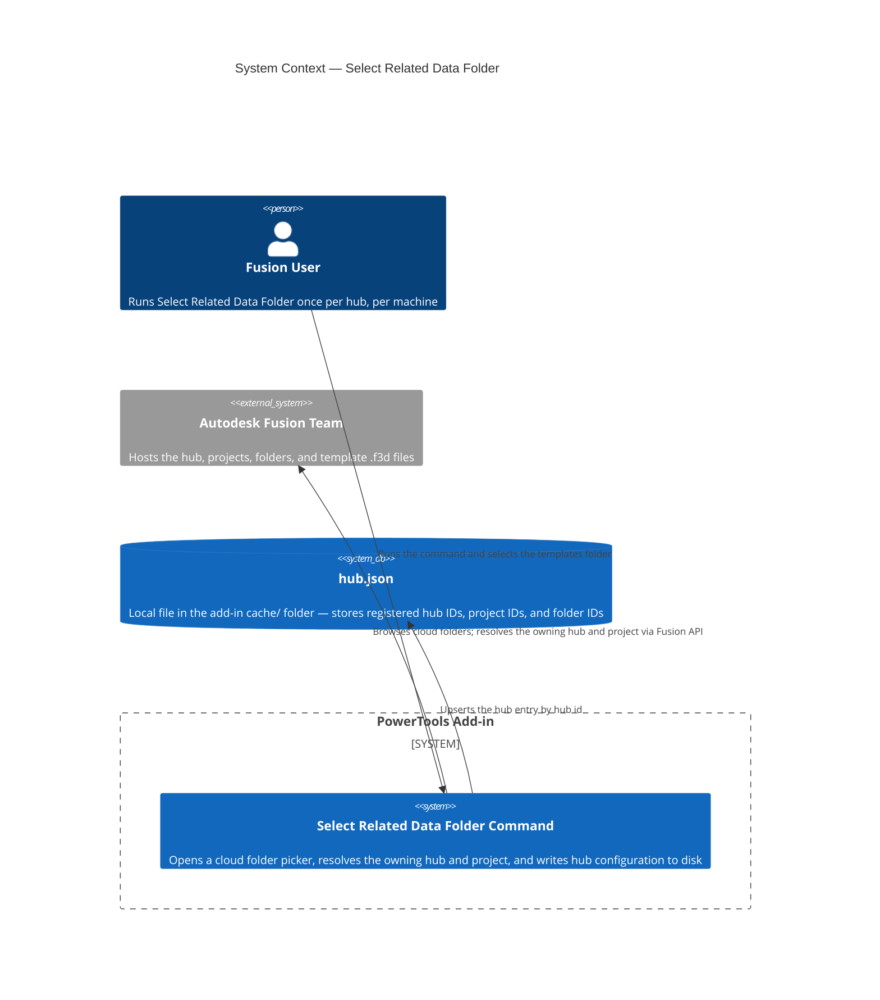
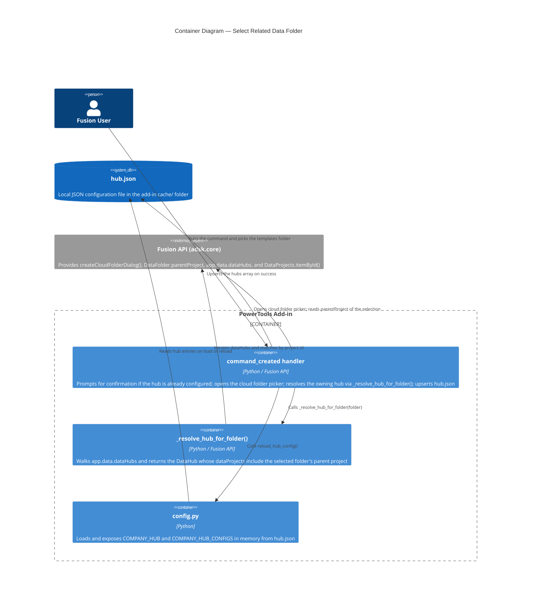

# Select Related Data Folder — Architecture

[← Select Related Data Folder guide](../Select%20Related%20Data%20Folder.md)

## Architecture

### How the command works

When you run **Select Related Data Folder**, the add-in follows this sequence:

1. Loads the current `hub.json` and looks up the active hub. If an entry already exists, an OK / Cancel prompt shows the current project and folder so you can either keep the configuration or proceed and overwrite it.
2. Displays an informational prompt instructing you to browse to the cloud folder that contains your start parts or templates.
3. Opens Fusion's cloud folder picker. If a saved document is open, the picker starts in that document's parent folder.
4. Reads the selected folder's parent project, then iterates through the available data hubs to find the one that owns that project.
5. Builds a hub entry containing the hub, project, and folder IDs and names, and upserts it into the `hubs` array in `hub.json` (replacing any previous entry with the same hub ID).
6. Reloads the in-memory configuration so all commands immediately see the new hub, then displays a success message that says whether the entry was added or updated.

### System context

### Container detail

