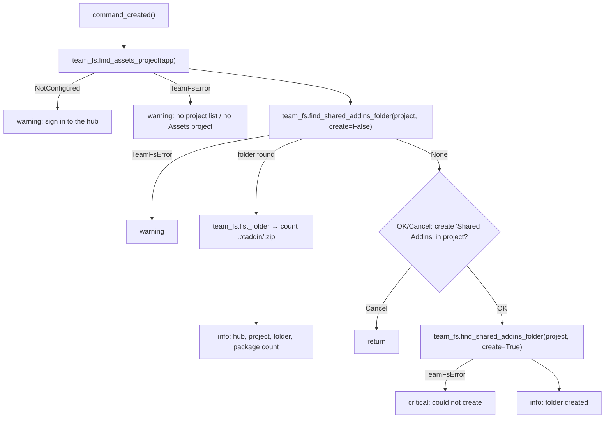

# Set Up Shared Add-ins Folder — Architecture

[← Set Up Shared Add-ins Folder guide](../Set%20Up%20Shared%20Add-ins%20Folder.md)

| | |
|---|---|
| **Command ID** | `f"{config.COMPANY_NAME}_{config.ADDIN_NAME}_configTeamAddins"`, which resolves to `IMA LLC_PowerTools_configTeamAddins` when the add-in folder is named `PowerTools`. The space breaks rule 9; the module is allowlisted in `KNOWN_NONLITERAL_CMD_IDS` in `tests/test_command_contract.py`, and the ID is not fixed because renaming a `CMD_ID` orphans users' QAT pins. The same f-string is rebuilt as `CONFIG_CMD_ID` in `commands/teamaddins/entry.py` and `CONFIG_TEAM_ADDINS_CMD_ID` in `commands/preferences/entry.py`. |
| **Registry** | group `teamaddins` (`Team Add-ins`); enabled by default |
| **UI location** | none — no toolbar control. Launched by `ui.commandDefinitions.itemById(<id>).execute()` from two places: the Preferences palette's Team Add-ins section (`setUpTeamAddinsFolder` HTML action) and the Team Add-ins report palette's "Create shared folder…" button (`configure` HTML action in `teamaddins/entry.py::_palette_incoming`). |
| **Files** | `commands/configteamaddins/entry.py`; `resources/` (16/32/64 light, dark, disabled PNGs, generated by `commands/teamaddins/resources/generate_icons.py::config_team_addins_mask` — a folder outline with a puzzle piece inside it) |
| **Shared helpers** | `commands/teamaddins/team_fs.py` (`find_assets_project`, `find_shared_addins_folder`, `list_folder`, `active_hub`, `PACKAGE_SUFFIXES`, `NotConfigured`, `TeamFsError`) — see [Team Add-ins](Team%20Add-ins.md); [`ptutil.add_handler`](architecture.md#event_utils); [`ptutil.log`](architecture.md#general_utils) |
| **Tests** | `tests/test_command_contract.py`, `tests/test_command_icons.py`; the hub navigation it calls is covered by `tests/test_teamaddins_team_fs.py` |

## Purpose

Finds, or on request creates, the folder that [Team Add-ins](Team%20Add-ins.md) reads packages from, and reports what it found. There is nothing to browse for and nothing to save: the location is the convention `<active hub> / Assets / Shared Addins`, resolved live by `team_fs`, so this command writes nothing to disk and every teammate on the hub resolves the same folder. The constraint: the `Assets` project must already exist — creating a project needs Fusion Team admin rights, so the command refuses to do it and says so.

## How it is wired

- `start()`: reuses `ui.commandDefinitions.itemById(CMD_ID)` if present, otherwise `addButtonDefinition`; wires `commandCreated` → `command_created` with [`ptutil.add_handler`](architecture.md#event_utils). No control is placed.
- `stop()`: deletes the definition.
- `command_created(args)` does the whole job and adds no command inputs, so Fusion auto-terminates the command and `execute` never runs ([acting from `commandCreated`](architecture.md#acting-from-commandcreated-when-there-are-no-inputs)); it therefore works with no document open, which is the state the Preferences palette is often used in. In order:
  1. `team_fs.find_assets_project(app)`. `NotConfigured` (no active hub) → warning "Sign in to the hub that holds your team's 'Assets' project", return. Any other `TeamFsError` (no project list, no `Assets` project) → warning with the exception text, return.
  2. `team_fs.find_shared_addins_folder(project, create=False)`. `TeamFsError` → warning, return.
  3. Folder found → counts entries from `team_fs.list_folder(existing)` whose name ends in one of `PACKAGE_SUFFIXES` (`.ptaddin`, `.zip`; a listing error counts as 0), shows an information box with hub name (`team_fs.active_hub(app).name`), project, folder and package count, and returns. An existing folder is never modified.
  4. Folder missing → OK/Cancel confirmation naming the project the folder will be created in; Cancel returns.
  5. `team_fs.find_shared_addins_folder(project, create=True)`. `TeamFsError` → critical message (typically a permissions failure), return.
  6. Information box "'Shared Addins' created in '<project>'".

## Data and state

None. No files, no settings keys, no custom events, no module state beyond the constants. The `CMD_Description` is built at import from `team_fs.ASSETS_PROJECT_NAME` and `team_fs.SHARED_ADDINS_FOLDER_NAME`.

## Folder matching

`team_fs.find_shared_addins_folder` walks `project.rootFolder.dataFolders`: an exact `Shared Addins` match returns immediately; otherwise the first folder whose `_folder_key` (lower-cased, non-alphanumerics removed) equals `sharedaddins` is adopted, so `Shared AddIns`, `shared add-ins` and `SharedAddins` are reused rather than duplicated. Only when nothing matches and `create=True` is `dataFolders.add("Shared Addins")` called. The automatic Team Add-ins check never passes `create=True`; this command is the only place the user is asked.

## Diagram

The find-or-create decision in `command_created`, with every exit:

## Tests

- `tests/test_command_contract.py` — registry/doc/description contract; pins `configteamaddins` in `KNOWN_NONLITERAL_CMD_IDS` and asserts the resolved `CMD_ID` still violates the ID shape. Its `KNOWN_ARCH_GAPS` allowlist lists `Set Up Shared Add-ins Folder.md` as having no architecture note; that entry must be removed now that this note exists.
- `tests/test_command_icons.py` — pins the full 16/32/64 light/dark/disabled set for `configteamaddins` and asserts it differs from `confighub`'s art and from every other command's.
- `tests/test_teamaddins_team_fs.py` — the loose folder matching (exact wins, unrelated names rejected), `create=False` returns `None`, `create=True` adds once, a missing `Assets` project explains that it needs an admin, no hub is `NotConfigured`.

Not covered: `entry.py` is Fusion-bound and is not exercised by the suite; nothing here is verified in Fusion on this branch except by the AST guards in `tests/test_command_contract.py` and `tests/test_command_abort.py`, which import it under the `adsk` stub.

---

*Copyright © 2026 IMA LLC. All rights reserved.*
