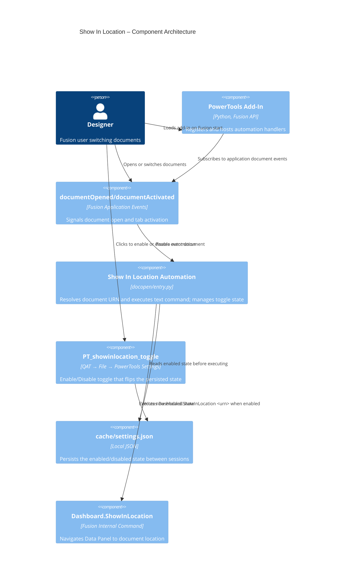

# Show In Location — Architecture

[← Show In Location guide](../Show%20In%20Location.md)

## Architecture

The Show In Location automation registers application-level event handlers on startup for `documentOpened` and `documentActivated`. Each event passes the event document to a shared helper that resolves the document URN and executes `Dashboard.ShowInLocation <urn>` through `app.executeTextCommand`.

### Command IDs

- Toggle button: `PT_showinlocation_toggle` (in the **PowerTools Settings** dropdown in the QAT File menu)

### Execution flow

1. The add-in starts and registers handlers for `app.documentOpened` and `app.documentActivated`.
2. The add-in installs a **Disable / Enable Show In Location** toggle button into the **PowerTools Settings** sub-menu in the QAT File dropdown.
3. The user opens a document or activates a different document tab.
4. The handler checks the persisted enabled state; if disabled, it exits immediately.
5. The handler validates that the event includes a document and a cloud `dataFile`.
6. The helper reads `doc.dataFile.id` and executes `Dashboard.ShowInLocation <urn>`.
7. The Data Panel selection updates to the current document location.

To toggle the automation, the user selects the toggle button in **PowerTools Settings**. The handler flips the state, saves it to `cache/settings.json`, and updates the button label.

### Component diagram

