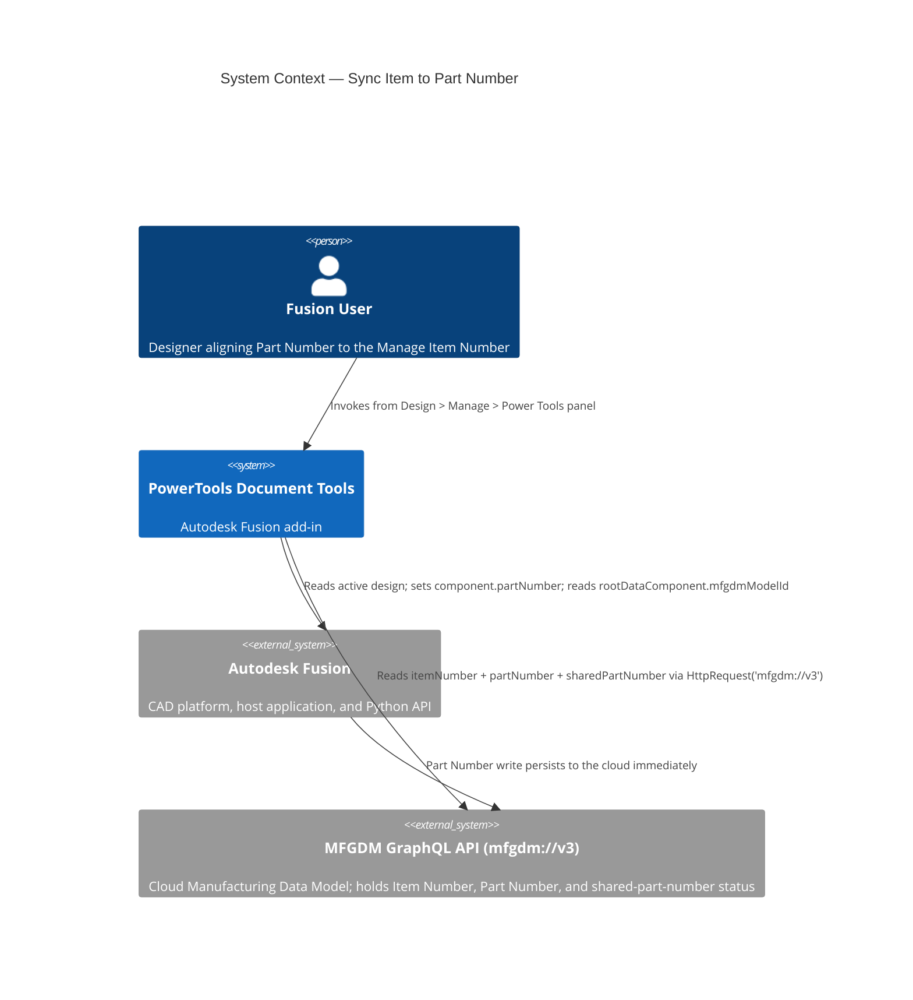
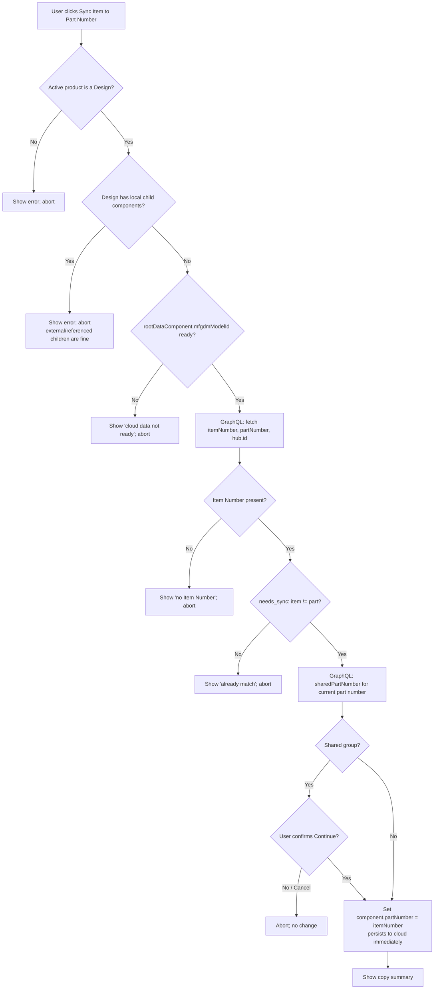

# Sync Item to Part Number — Architecture

[← Sync Item to Part Number guide](../Sync%20Item%20to%20Part%20Number.md)

## Architecture

### Command ID

`PTND_syncitempartnumber`

### System context



### The local ↔ cloud ID bridge (the load-bearing detail)

The Fusion Manage **Item Number** and the **shared part number** status are cloud
values with no local Desktop API accessor, so both are read through the
Manufacturing Data Model GraphQL API. The local and cloud APIs use **different,
non-interchangeable IDs**, so the bridge is precise:

1. **Anchor** on the local, timeless model id: `design.rootDataComponent.mfgdmModelId`
   (plus `.timestamp`, `""` = at-tip).
2. Resolve the cloud objects from it:
   `model(modelId, time) { component { id hub { id } itemNumber { id } partNumber { value } } }`.
   - `component.id` is the time-specific **componentId**.
   - `component.hub.id` is the MDM hub id (`urn:adsk...`). **This — not the local
     `app.data.activeHub.id` (`a.<base64>`) — is the value the `sharedPartNumber`
     query requires**; the local hub id is rejected with *"Invalid hub or project
     id. It must start with 'urn:adsk'."*
   - `component.itemNumber.id` is the human-readable Item Number (e.g. `PN-000038`),
     `""` when none is assigned. (`itemNumber.sequenceProperty` is an internal
     base64 scheme/sequence blob and is ignored.)

The transport is `adsk.core.HttpRequest.create("mfgdm://v3", PostMethod)`, which
attaches the logged-in user's auth. All of this lives in
`commands/partnumber_shared/mfgdm_props.py` (`_gql`, `fetch_item_part_hub`,
`is_part_number_shared`).

### Shared part number detection

`sharedPartNumber(hubId, partNumber)` returns a `SharedPartNumberInfo`
(`partNumber`, `component`, `isPresent`, `isModeled`) — with **no member count**.
Group size is inferred from `component.models`, which is permission-filtered and
paginated:

```
shared = isPresent && isModeled &&
         ( len(models.results) > 1
           || models.isAllReadableByUser == false   // group has models this user can't read
           || models.pagination.cursor != "" )      // more members beyond the first page
```

`isAllReadableByUser == false` is the key case: a shared group whose other members
aren't readable by the current user returns only this model in `results`, so a raw
`len(results)` would under-count.

### Enablement

The command button is enabled whenever a Fusion design is the active product
(`Design.cast(app.activeProduct) is not None`), refreshed on `documentActivated`
and `documentOpened`. No cloud call is made to decide enablement — all item/part
validation happens in `command_execute`. (An earlier design gated enablement on
the cloud Item Number via the `mfgdmDataReady` event; it was simplified to
always-enabled-with-a-design to avoid per-open network reads.)

### Execution flow



### Pure logic (unit-tested)

`commands/syncitempartnumber/logic.py` holds the Fusion-free helpers so they can
be tested without the host (`tests/test_syncitempartnumber_logic.py`):

| Symbol | Role |
|---|---|
| `normalize_item(item)` | Strip an Item Number for comparison |
| `normalize_pn(pn)` | Strip a Part Number; treat Fusion's auto-timestamp placeholder as empty (reuses `partnumber_shared.intent.is_fusion_auto_pn`) |
| `needs_sync(item, part)` | True when an Item Number exists and differs from the (normalized) Part Number — governs what `command_execute` does |

### UI ownership

The command owns a `PT_ManagePowerTools` panel on the **built-in `ManageTab`**
(added by the Fusion Manage Extension). It never creates or deletes the Manage
tab; on stop it removes its control and deletes its own panel only when empty. If
the Manage Extension is off, `ManageTab` is absent and the command skips UI
registration entirely. IDs are defined in `config.py` (`manage_tab_id`,
`manage_panel_id`, `manage_panel_name`, `manage_panel_after`).

### Reproducing the API findings

`experiments/SyncItemExperiment/` is a read-only Fusion script that dumps the
local ids, performs the bridge, introspects the relevant GraphQL types, and runs
`sharedPartNumber` against both the correct and the local hub id. It was used to
establish everything above and can be re-run to re-validate against a hub.

---

[← Sync Item to Part Number guide](../Sync%20Item%20to%20Part%20Number.md)

---

*Copyright © 2026 IMA LLC. All rights reserved.*
