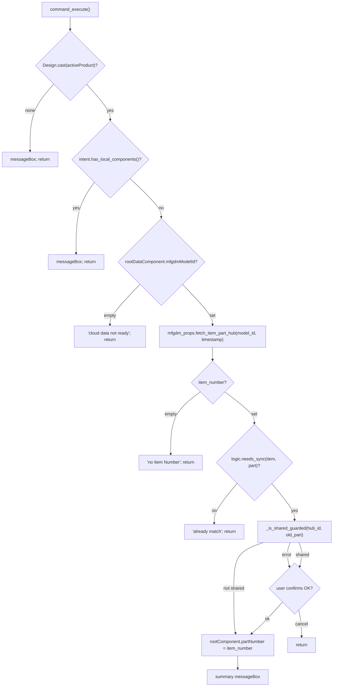

# Sync Item to Part Number — Architecture

[← Sync Item to Part Number guide](../Sync%20Item%20to%20Part%20Number.md)

| | |
|---|---|
| **Command ID** | `PTND_syncitempartnumber` |
| **Registry** | group `document` (`Document Tools`); enabled by default; not beta |
| **UI location** | Design workspace (`config.design_workspace`) → built-in `ManageTab` (added by the Fusion Manage Extension) → panel `PT_ManagePowerTools` ("Power Tools"), created by this command when absent and appended at the end of the tab; promoted button. When `ManageTab` is absent the definition is registered but no control is placed |
| **Files** | `commands/syncitempartnumber/entry.py`; `logic.py` (`adsk`-free); `resources/` (16/32/64 px light + dark icons) |
| **Shared helpers** | [`partnumber_shared.mfgdm_props`](architecture.md#partnumber_shared) (`fetch_item_part_hub`, `is_part_number_shared`) and `partnumber_shared.intent` (`has_local_components`, `is_fusion_auto_pn`); [`ptutil.add_handler`](architecture.md#event_utils); [`ptutil.log`, `handle_error`](architecture.md#general_utils); `config.manage_*` ids ([config](architecture.md#config)) |
| **Tests** | `tests/test_syncitempartnumber_logic.py`; `tests/test_command_icons.py`; `tests/test_command_contract.py` |

## Purpose

Copies the active design's Fusion Manage **Item Number** into its **Part Number** (`rootComponent.partNumber`) so drawings, BOMs and exports read the number Manage assigned. Both the Item Number and the shared-part-number status are cloud values with no desktop-API accessor, so the command bridges from the local `mfgdmModelId` to MFGDM GraphQL, and that id bridge is the load-bearing detail.

## How it is wired

- `start()`: `addButtonDefinition` with the resources folder; `ptutil.add_handler(cmd_def.commandCreated, command_created)`; looks up the Design workspace and `ManageTab`; returns early (logged) if either is missing; `toolbarPanels.add(PANEL_ID, PANEL_NAME, "", False)` when needed; `panel.controls.addCommand(cmd_def)`, `isPromoted = True`. Then registers `_on_document_event` on `app.documentActivated` and `app.documentOpened` in the session-long `_app_handlers` list (kept apart from `local_handlers` so `command_destroy` cannot drop them) and calls `_refresh_enabled()` once.
- `stop()`: clears `_app_handlers`; deletes the control, the definition, and the panel only when it is empty. `ManageTab` is never created or deleted.
- `_on_document_event(args)` → `_refresh_enabled()`: `cmd_def.controlDefinition.isEnabled = Design.cast(app.activeProduct) is not None`. No cloud call is made to decide enablement.
- `command_created(args)`: registers `command_execute` and `command_destroy` only. There are no `CommandInputs`, so Fusion auto-executes.
- `command_execute(args)`, in order, each failure a message box and return:
  1. `Design.cast(app.activeProduct)` is `None` → "requires an active Fusion 3D design".
  2. `intent.has_local_components(design)` → refuse; only a single model can be synced (referenced children are fine).
  3. `design.rootDataComponent.mfgdmModelId` empty → "Cloud data for this design isn't ready yet"; `timestamp = data.timestamp or ""`.
  4. Progress bar + `adsk.doEvents()`; `mfgdm_props.fetch_item_part_hub(model_id, timestamp)` → `(item_number, part_number, hub_id)`.
  5. No item number → box. `logic.needs_sync(item_number, old_part)` false → "already match".
  6. `_is_shared_guarded(hub_id, old_part)` behind the progress bar; if shared, an OK/Cancel confirmation; Cancel → return.
  7. `design.rootComponent.partNumber = item_number` — the write persists to the cloud immediately, no save needed — then an HTML summary box (component, old, new).
  Any exception → `ptutil.handle_error(CMD_NAME, show_message_box=True)`.
- `command_destroy(args)`: drops `local_handlers`.

`mfgdmModelId` is read inside `command_execute`, a synchronous command callback. `partnumber_shared/intent.py` documents that property as safe only inside an `MFGDMDataReady` handler; this site has not been observed to fail and has not been re-examined on this branch.

## Data and state

- Module state: `local_handlers` (per invocation), `_app_handlers` (session).
- No disk cache, no settings keys, no custom events.
- Written: `rootComponent.partNumber`.

## The local ↔ cloud id bridge

The two APIs use different, non-interchangeable ids:

1. Anchor on the local, timeless model id: `design.rootDataComponent.mfgdmModelId`, plus `.timestamp` (`""` = at tip).
2. `mfgdm_props.fetch_item_part_hub` runs `model(modelId, time) { component { hub { id } itemNumber { id } partNumber { value } } }` and returns:
   - `component.itemNumber.id` — the human-readable Item Number (e.g. `PN-000038`), `""` when none is assigned;
   - `component.partNumber.value` — the cloud-authoritative Part Number;
   - `component.hub.id` — the MDM hub id (`urn:adsk...`). **This, not the local `app.data.activeHub.id` (`a.<base64>`), is what `sharedPartNumber` requires**; the local id is rejected with "Invalid hub or project id. It must start with 'urn:adsk'."

The transport is `mfgdm_props._gql` (`adsk.core.HttpRequest.create("mfgdm://v3", PostMethod)`, `executeSync`), which carries the signed-in user's auth.

## Shared part number detection

`mfgdm_props.is_part_number_shared(hub_id, part_number)` queries `sharedPartNumber(hubId, partNumber) { isPresent isModeled component { models { isAllReadableByUser pagination { cursor } results { id } } } }`. The response has no member count, so group size is inferred from the permission-filtered, paginated `models` collection:

```
shared = isPresent && isModeled &&
         ( len(models.results) > 1
           || models.isAllReadableByUser == false   // members this user cannot read
           || models.pagination.cursor != "" )      // members beyond the first page
```

`isAllReadableByUser == false` is the case a raw `len(results)` would miss: a group whose other members are unreadable returns only this model.

`_is_shared_guarded` wraps it fail-safe: `False` for an empty or auto-generated placeholder part number (`intent.is_fusion_auto_pn`), and `True` on any transport or GraphQL error, so a possibly shared number is never overwritten without the confirmation.

## Pure logic (`logic.py`)

| Symbol | Role |
|---|---|
| `normalize_item(item)` | Strip; `""` for `None` |
| `normalize_pn(pn)` | Strip; Fusion's auto-timestamp placeholder becomes `""` (via `partnumber_shared.intent.is_fusion_auto_pn`) |
| `needs_sync(item, part)` | True only when an Item Number exists and differs from the normalized Part Number |

## Diagram

The execute path; every "no" branch is a message box and an early return.


```mermaid
flowchart TD
    A["command_execute()"] --> B{"Design.cast(activeProduct)?"}
    B -- none --> X1["messageBox; return"]
    B -- yes --> C{"intent.has_local_components()?"}
    C -- yes --> X2["messageBox; return"]
    C -- no --> D{"rootDataComponent.mfgdmModelId?"}
    D -- empty --> X3["'cloud data not ready'; return"]
    D -- set --> E["mfgdm_props.fetch_item_part_hub(model_id, timestamp)"]
    E --> F{"item_number?"}
    F -- empty --> X4["'no Item Number'; return"]
    F -- set --> G{"logic.needs_sync(item, part)?"}
    G -- no --> X5["'already match'; return"]
    G -- yes --> H["_is_shared_guarded(hub_id, old_part)"]
    H -- error --> I
    H -- shared --> I{"user confirms OK?"}
    H -- not shared --> J
    I -- cancel --> X6["return"]
    I -- ok --> J["rootComponent.partNumber = item_number"]
    J --> K["summary messageBox"]
```

## Tests

- `tests/test_syncitempartnumber_logic.py` — twelve parametrized `needs_sync` cases (no item, exact and stripped matches, mismatch, empty or placeholder part numbers in both forms, a real `PN-000038`), plus `normalize_item` / `normalize_pn` edge cases.
- `tests/test_command_icons.py` — pins the `syncitempartnumber` icon set (16/32/64 px, light + dark) and that it differs from every other pinned set.
- `tests/test_command_contract.py` — registry row, `CMD_Description`, docs pair, `CMD_ID` shape.

The GraphQL bridge, the shared-group inference and the enablement toggling are not covered. `entry.py` and `mfgdm_props.py` are Fusion-bound and are not exercised by the suite; nothing here is verified in Fusion on this branch except by the AST guards in `tests/test_command_contract.py` and `tests/test_command_abort.py`, which import it under the `adsk` stub.

## Learnings

- **Cloud queries need `Component.hub.id` (`urn:adsk...`), not `app.data.activeHub.id`.** The local id is a different namespace and the service rejects it outright.
- **`sharedPartNumber` gives no member count.** Infer group membership from `models.results`, `isAllReadableByUser` and the pagination cursor together; counting results alone under-counts when other members are unreadable.
- **Enablement stays local.** Gating the button on the cloud Item Number (via `mfgdmDataReady`) meant a network read on every document open; enabling whenever a design is active and validating in `command_execute` costs nothing until the click.

---

*Copyright © 2026 IMA LLC. All rights reserved.*
