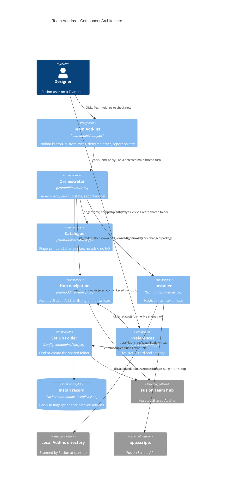
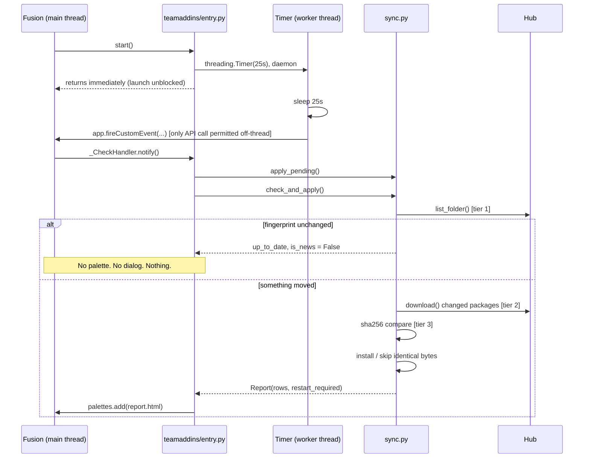

# Team Add-ins — Architecture

[← Team Add-ins guide](../Team%20Add-ins.md) · [← Set Up Shared Add-ins Folder guide](../Set%20Up%20Shared%20Add-ins%20Folder.md)

## Architecture

Team Add-ins installs add-ins published to a shared hub folder into the local Fusion AddIns directory and starts them in the running session. Three constraints shape the whole design:

1. **The Fusion Data API is main-thread only.** A background thread cannot read the hub, so the launch check is *deferred* onto a later main-loop turn rather than backgrounded.
2. **There is no publish step.** The folder listing is the catalogue, and Fusion's per-file version numbers are the change signal. Nothing read by the change logic is written by a human.
3. **Silence is the default.** An unchanged folder produces no UI at all.

### Command IDs

| Command | ID |
| ------- | -- |
| Team Add-ins | `PT_teamaddins` |
| Set Up Shared Add-ins Folder | `IMA LLC_PowerTools_configTeamAddins` |
| Custom event | `PT_teamaddins_startup_check` |
| Report palette | `config.team_addins_palette_id` |

### Module layout

| Module | Responsibility | `adsk` |
| ------ | -------------- | ------ |
| `commands/teamaddins/catalog.py` | Filename → add-in id, folder fingerprint, change plan | no |
| `commands/teamaddins/team_fs.py` | Hub → Assets project → Shared Addins folder; listing and download | yes |
| `commands/teamaddins/installer.py` | Verify, extract, swap, load/stop, pending staging | yes |
| `commands/teamaddins/sync.py` | Tiered orchestration and the report model | yes |
| `commands/teamaddins/entry.py` | Lifecycle, toolbar button, deferred check, report palette | yes |
| `commands/configteamaddins/entry.py` | Find-or-create the shared folder | yes |

`catalog.py` is deliberately free of `adsk` and of I/O, so the whole decision core is testable as plain Python.

### Location convention

```
<active hub> / Assets / Shared Addins /
```

Mirrors `commands/partnumber_shared/hub_fs.py` (`Assets / Pn-Cache`). The navigation is *copied* rather than imported: `hub_fs`'s messages are written for the part-numbering flow. The Assets project must pre-exist (project creation needs Team admin rights); the folder is created only on explicit request from Preferences, never by the check.

Folder matching normalises case, spaces and dashes (`_folder_key`), so a hand-made `Shared AddIns` is adopted instead of duplicated. An exact match always wins.

### Deferred launch check

```
teamaddins.start()                     returns immediately
  ├─ register command + toolbar control
  ├─ app.registerCustomEvent(...)      (unregister first, for clean reloads)
  └─ threading.Timer(25s).start()      daemon

_fire_check()   [worker thread]        app.fireCustomEvent(...)  ← only call permitted here
_CheckHandler.notify()  [main thread]  apply pending → check → report
```

Three constraints carried over verbatim from `commands/assemblypalette/entry.py:_schedule_finish_insert`:

- The worker thread must touch nothing but `fireCustomEvent` — not even `ptutil.log`, which calls `Application.log`.
- `fireCustomEvent` returns `False` even when the event fires; its return value is ignored.
- The timer is a daemon, so a pending check never holds Fusion open.

The timer is scheduled even when the automatic check is disabled, so a package staged by a previous session still gets applied. Doing that in `start()` instead would put file moves and a script start onto Fusion's launch path.

If `activeHub` is `None` when the handler runs, it reschedules **once** at +60 s, then gives up silently.

### Tiered check

| Tier | Call | Short-circuit |
| ---- | ---- | ------------- |
| 1 | `team_fs.list_folder()` → `catalog.fingerprint()` | `{filename: revision}` identical to cache → return |
| 2 | `team_fs.download()` per changed package | Only new or revision-bumped files |
| 3 | `installer.content_changed()` (sha256) | Identical bytes → record revision, install nothing |

Tier 1 catches additions, removals and re-uploads in a single comparison. The sha256 is *change confirmation*, not authenticity: with no published digest there is nothing to authenticate against, and write access to the hub folder is the trust boundary. What it buys is that a re-upload of identical content never tears down a running add-in.

### Install sequence

`installer.install_package()`:

1. Hash the download (recorded for tier 3 next time).
2. `safe_extract()` — every member path resolved and rejected if it escapes the destination.
3. `locate_package_root()` — handles both a zipped folder and zipped contents.
4. `validate_package_root()` — `<id>.manifest` must be present, since Fusion pairs folder to manifest by name.
5. `read_manifest_version()` — display only; frequently absent or stale.
6. `is_self()` guard — refuse anything resolving to the running Power Tools folder.
7. **`stop_addin()` → `remove_tree()` → `shutil.move()` → `load_addin()`.**
8. On a locked folder, `stage_pending()` under `cache/team-addins/pending/<id>/`, applied at the next `start()`.

Step 7's ordering is the fix for a defect in the Add-in Market original (`PowerTools-Addinmarket/commands/addinmarket/installer.py`), which deleted the install folder while the old add-in was still running and so left the old module loaded over new files. Three other defects were fixed in the port: `isRunOnStartup` read without an `isAddIn` guard, `extractall` with no zip-slip guard, and no self-install guard.

Live loading is `app.scripts.itemByPath()` → `addExisting()` → `isRunOnStartup` → `run()`.

### State

`cache/team-addins-installed.json`, keyed by hub id:

```
{ "hubs": { "<hub_id>": {
    "fingerprint": { "<filename>": <revision> },
    "addins": { "<id>": { "hub_version", "sha256", "version", "installed_at", "path", "pending_restart" } },
    "reported_orphans": [ "<id>" ],
    "failed": { "<filename>": <revision> },
    "checked_at": "<local time>"
} } }
```

Per-hub because the folder is resolved live rather than saved: carrying one hub's fingerprint to another would either mask a real change or report every add-in as an orphan.

- `fingerprint` is only committed when **every** change succeeded, so a failure retries on the next launch instead of being silently skipped.
- `failed` suppresses a repeat report of the same file at the same revision from the *automatic* check. A manual check ignores it.
- `reported_orphans` makes a vanished package news exactly once.

### Reporting

`sync.Report` → `to_dict()` → `init.js` → `resources/html/report.{html,css,js}`. The palette is created fresh per check (`palettes.add(..., useNewWebBrowser=True)`), so a stale report can never be on screen. `Report.is_news` gates whether the automatic check opens it at all; the manual check always opens it.

### Component diagram



### Deferred check sequence



---

[← Team Add-ins guide](../Team%20Add-ins.md)
