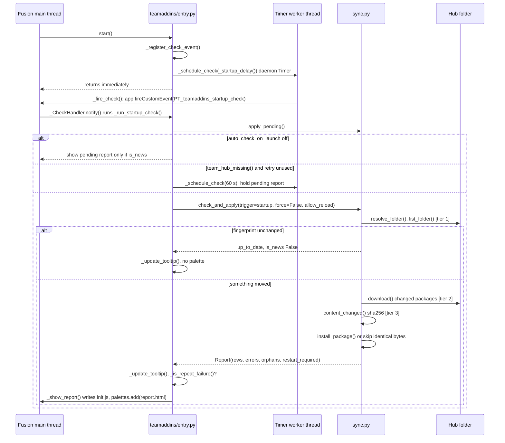

# Team Add-ins — Architecture

[← Team Add-ins guide](../Team%20Add-ins.md)

| | |
|---|---|
| **Command ID** | `PT_teamaddins`; custom event `PT_teamaddins_startup_check`; report palette `config.team_addins_palette_id` (`IMA_LLC_PowerTools_team_addins_palette`) |
| **Registry** | group `teamaddins` (`Team Add-ins`); enabled by default; `settings=True` (owns the Team Add-ins section of the Preferences palette) |
| **UI location** | the shared Power Tools panel (Design workspace → Tools tab → `config.my_panel_id`), via [`_ui_bootstrap.get_power_tools_panel()`](architecture.md#_ui_bootstrap); appended, not promoted. The report is a floating-then-docked-right palette. |
| **Files** | `commands/teamaddins/entry.py` (lifecycle, deferred check, manual check, palette), `sync.py` (check → plan → apply → report), `installer.py` (verify, extract, swap, live-load, staging), `team_fs.py` (hub navigation, listing, download), `catalog.py` (`adsk`-free: ids, fingerprint, change plan); `resources/html/report.{html,css,js}` plus the generated, git-ignored `init.js`; `resources/generate_icons.py` (also draws the [Set Up Shared Add-ins Folder](Set%20Up%20Shared%20Add-ins%20Folder.md) icon) |
| **Shared helpers** | [`_ui_bootstrap.get_power_tools_panel`](architecture.md#_ui_bootstrap); [`settings_store.command_setting`](architecture.md#settings_store); [`config`](architecture.md#config) (`CACHE_PATH`, `fusion_addins_dir`, `team_addins_palette_id`, `ADDIN_PATH`); [`ptutil.add_handler`](architecture.md#event_utils); [`ptutil.read_json`, `write_json_atomic`](architecture.md#json_utils); [`ptutil.log`, `handle_error`](architecture.md#general_utils) |
| **Tests** | `tests/test_teamaddins_catalog.py`, `tests/test_teamaddins_installer.py`, `tests/test_teamaddins_sync.py`, `tests/test_teamaddins_team_fs.py`, `tests/test_command_contract.py`, `tests/test_command_icons.py` |

## Purpose

Installs add-ins that a teammate has zipped into the hub folder `<active hub> / Assets / Shared Addins` into the local Fusion AddIns directory and starts them in the running session. Three constraints shape the design: the Fusion Data API is main-thread only, so the launch check is *deferred* to a later main-loop turn rather than run on a worker thread; there is no publish step — the folder listing is the catalogue and Fusion's per-file version number is the change signal; and silence is the default — an unchanged folder produces no UI at all.

## How it is wired

- `start()`: reuses or adds the button definition; `commandCreated` → `command_created`; clears any stale `PT_teamaddins` controls from the Power Tools panel and adds one (`isPromoted = False`); `_register_check_event()` — `app.unregisterCustomEvent` first (clean reload), then `app.registerCustomEvent(_CHECK_EVENT_ID)` with a `_CheckHandler` instance held in the module global `_check_event_handler`; `_schedule_check(_startup_delay())`. The timer is scheduled even when the automatic check is off, so packages staged by a previous session are still applied — on the deferred turn, never inside `start()`, which keeps file moves and script starts off Fusion's launch path.
- `stop()`: cancels `_timer`, unregisters the custom event, drops the handler and any pending report, deletes the palette, the panel control and the definition, clears `local_handlers`, resets `_retry_used`.
- Deferred check ([pattern](architecture.md#deferring-work-to-a-later-main-loop-turn)):
  - `_schedule_check(delay)`: daemon `threading.Timer(delay, _fire_check)`. `_startup_delay()` reads the `startup_delay_seconds` setting (default 25) and clamps it to 5–600 s.
  - `_fire_check()` on the worker thread calls only `app.fireCustomEvent(_CHECK_EVENT_ID)`; the return value is ignored and nothing else — not even `ptutil.log` — is touched.
  - `_CheckHandler.notify()` on the main thread runs `_run_startup_check()` under `handle_error`:
    1. `sync.apply_pending()` (or the report held from a previous attempt) finishes any swap a previous session could not complete.
    2. `auto_check_on_launch` off → log; if the pending report `is_news`, `_update_tooltip` and `_show_report`; return.
    3. `team_hub_missing()` and `_retry_used` false → hold the pending report in `_startup_pending_report`, `_schedule_check(60.0)`, return. The retry happens once; a second miss ends silently.
    4. `sync.check_and_apply(trigger="startup", force=False, allow_reload=<auto_reload>)`; `_merge` the pending report into it; `_update_tooltip(report)`.
    5. `not report.is_news` → return. `_is_repeat_failure(report)` (a pure-failure report whose file/revision set equals the previous run's) → return. Otherwise `_show_report(report)`.
- Manual check: `command_created(args)` adds no inputs, so Fusion auto-terminates after it ([pattern](architecture.md#acting-from-commandcreated-when-there-are-no-inputs)); it shows `ui.progressBar.showBusy`, runs `sync.check_and_apply(trigger="manual", force=True, allow_reload=<auto_reload>)`, hides the bar, updates the tooltip and always calls `_show_report`, so a click always gets an answer.
- `_update_tooltip(report)`: rewrites `CommandDefinition.tooltip` to `CMD_Description` plus a status line ("No Shared Addins folder in this hub yet." / "Last checked … — restart Fusion to finish." / "… — <headline>." / "… — problems found." / "… — up to date."), so the button is the always-available status.
- Report palette ([pattern](architecture.md#palette-to-python-rpc)): `_show_report(report)` deletes any existing palette, writes `window.__ptTeamAddins = <report.to_dict() + theme>` to `resources/html/init.js`, then `ui.palettes.add(id=PALETTE_ID, htmlFileURL=report.html, isVisible=True, showCloseButton=True, isResizable=True, width=560, height=460, useNewWebBrowser=True)`, wires `closed` → `_palette_closed` (deletes the palette) and `incomingFromHTML` → `_palette_incoming`, and docks it right if it opened floating. `_theme()` resolves `activeUserInterfaceTheme`, falling back to `userInterfaceTheme` with `DeviceUserInterfaceTheme` treated as dark. `report.js` renders once from `init.js`; there is no polling. Actions: `close` deletes the palette; `configure` runs `ui.commandDefinitions.itemById(CONFIG_CMD_ID).execute()` (Set Up Shared Add-ins Folder) or explains that the group is disabled. Every action sets `returnData = "OK"`.

## Data and state

- Settings (`settings_store.COMMAND_SETTING_DEFAULTS["teamaddins"]`, read through `_setting()` with a fallback on any exception): `auto_check_on_launch` (True), `startup_delay_seconds` (25; `_DEFAULT_DELAY_SECONDS` mirrors it), `auto_reload` (True — False writes updates to disk and leaves them for the next restart).
- Module globals in `entry.py`: `_check_event_handler`, `_timer`, `_retry_used`, `_startup_pending_report`, `local_handlers`.
- `cache/team-addins-installed.json` (`sync.INSTALLED_FILE`), keyed by hub id:

  ```
  { "hubs": { "<hub_id>": {
      "fingerprint": { "<filename>": <revision> },
      "addins": { "<id>": { "hub_version", "sha256", "version", "installed_at", "path", "pending_restart" } },
      "reported_orphans": [ "<id>" ],
      "failed": { "<filename>": <revision> },
      "checked_at": "<YYYY-MM-DD HH:MM>"
  } } }
  ```

  Per hub because the folder is resolved live rather than saved: carrying one hub's fingerprint to another would either mask a real change or report every add-in as an orphan. `fingerprint` is committed only when every change succeeded, so a failure retries on the next launch. `failed` makes the automatic check stay quiet about the same file at the same revision; a re-upload changes the revision and is news again; a manual check ignores it. `reported_orphans` makes a vanished package news exactly once.
- Scratch: `cache/team-addins/work/` (downloads and `<id>__extract/`, removed after each check); staging: `cache/team-addins/pending/<id>/` (packages that could not be swapped in while running; drained by `installer.apply_pending`, the root directory removed once empty).
- Install target: `config.fusion_addins_dir()/<id>/` — `~/Library/Application Support/Autodesk/Autodesk Fusion 360/API/AddIns` on macOS, `%APPDATA%\Autodesk\Autodesk Fusion 360\API\AddIns` on Windows.
- `resources/html/init.js`: regenerated before every palette open; git-ignored.
- Custom event: `PT_teamaddins_startup_check`.

## Module layout

| Module | Responsibility | `adsk` |
| ------ | -------------- | ------ |
| `catalog.py` | filename → add-in id (`split_package_name`, `is_valid_addin_id` = `^[A-Za-z0-9][A-Za-z0-9._-]{0,99}$`), `build_catalog`, `fingerprint`, `plan_changes` | no |
| `team_fs.py` | hub → `Assets` → `Shared Addins` (`find_assets_project`, `find_shared_addins_folder`, `resolve_folder`, `folder_status`); listing and download (`list_folder`, `find_file`, `download`) | yes |
| `installer.py` | verify (`sha256_of`, `content_changed`, `safe_extract`, `validate_package_root`, `is_self`), swap (`remove_tree`, `stage_pending`), session (`load_addin`, `stop_addin`), `install_package`, `apply_pending` | yes |
| `sync.py` | `check_and_apply`, `apply_pending`, per-hub state (`load_state` / `save_state`, `installed_summary`), the `Report` / `Row` model | yes |
| `entry.py` | lifecycle, toolbar button, deferred check, tooltip, report palette | yes |

`catalog.py` has no `adsk` import and does no I/O, so the whole decision core is tested as plain Python ([the pure-logic split](architecture.md#the-pure-logic-split)). `team_fs.folder_status` and `sync.installed_summary` also feed the live status card in the Preferences palette (`commands/preferences/entry.py::_team_addins_info`).

## Location convention

`<active hub> / Assets / Shared Addins /` — the same shape `commands/partnumber_shared/hub_fs.py` uses for `Assets / Pn-Cache`. The navigation is mirrored rather than imported because `hub_fs`'s messages are written for the part-numbering flow. The `Assets` project must pre-exist (project creation needs Team admin rights); the folder is created only by [Set Up Shared Add-ins Folder](Set%20Up%20Shared%20Add-ins%20Folder.md), never by the check (`resolve_folder` is always called with `create=False`). Folder matching normalises case, spaces and dashes (`_folder_key`), so a hand-made `Shared AddIns` is adopted; an exact match always wins. `team_fs.NotConfigured` (no hub, or no folder yet) is distinct from `TeamFsError` because it is the normal pre-setup state and must stay silent.

## Tiered check

`sync.check_and_apply`, after `team_fs.resolve_folder` (`NotConfigured` → `STATUS_NOT_CONFIGURED`; `TeamFsError` → `STATUS_ERROR`; anything else → `STATUS_UNAVAILABLE`; all three return before touching state):

| Tier | Call | Short-circuit |
| ---- | ---- | ------------- |
| 1 | `team_fs.list_folder()` → `catalog.fingerprint()` | `{filename: revision}` identical to the cached one and `force` false → write `checked_at`, return `up_to_date` |
| 2 | `catalog.build_catalog` + `catalog.plan_changes` against `state["addins"]`; `team_fs.find_file` + `team_fs.download` per change | Only new packages and revision bumps are downloaded; a plan with no changes commits the fingerprint and clears `failed` |
| 3 | `installer.content_changed(download, record["sha256"])` | Identical bytes → record the new `hub_version`, count as skipped, install nothing |

Tier 1 catches additions, removals and re-uploads in one comparison. `team_fs.file_name_of` reattaches `fileExtension` when a build reports `DataFile.name` without it, because the extension is what marks a file as a package; `latest_version_of` reads `latestVersionNumber`, then `versionNumber`, else 0. The sha256 is change confirmation, not authenticity: there is no published digest to check against, and write access to the hub folder is the trust boundary. What it buys is that a re-upload of identical content never tears down a running add-in.

Every per-package failure is a `Row` with `state="failed"` and a message; one bad package never blocks the others. The final status is `applied` if anything installed, else `error` if anything failed, else `up_to_date`; `_headline` phrases it ("Downloaded N team add-ins" when a restart is required, "Updated N …" otherwise).

## Install sequence

`installer.install_package(ref, package_path, action, extract_parent, allow_reload)`:

1. `sha256_of(package)` — recorded in the install record for tier 3 next time.
2. `safe_extract()` into `<work>/<id>__extract/` — every member path is resolved and the archive is refused if any escapes the destination; a non-zip is refused with a message asking for a re-upload.
3. `locate_package_root()` — a zip of one top-level folder or a zip of the folder's contents (`__MACOSX` ignored).
4. `validate_package_root()` — `<id>.manifest` must be present, because Fusion pairs folder and manifest by name; a differently named manifest is reported naming both sides.
5. `read_manifest_version()` — display only; tolerant of a BOM, absent or unreadable → `""`.
6. `dest = fusion_addins_dir()/<id>`; `is_self(dest)` refuses anything that resolves to, or contains, the running PowerTools folder (paths compared with `normcase` + `casefold`).
7. If `dest` exists: `stop_addin(dest)` → `remove_tree(dest)`. `remove_tree` retries `shutil.rmtree` up to 4 times with a 0.25 s `time.sleep` back-off (Windows keeps a handle open briefly after a script stops; this sleep is recorded in `KNOWN_TIME_SLEEP_SITES` in `tests/test_command_contract.py`) and restores the write bit by OR-ing `S_IWRITE` onto the current mode on error. Removal still failing → `stage_pending(id, root)` moves the extracted root to `cache/team-addins/pending/<id>/`, result `ok=True, restart_required=True`.
8. `shutil.move(root, dest)`; with `allow_reload`, `load_addin(dest, id)`: `app.scripts.itemByPath()` → `addExisting()` if absent → `isRunOnStartup = True` only when `script.isAddIn` → `run()` if not running. `False` from `load_addin` means "Installed. Restart Fusion to activate it."; `allow_reload=False` reports the same without trying.

`installer.apply_pending()` (called from `sync.apply_pending` on the deferred turn) walks `pending/`, applies the same `is_self` refusal and stop → remove → move → `load_addin` sequence per staged folder, leaves anything still locked for the next launch, and removes the staging root once empty.

## Reporting

`sync.Report` (`status`, `headline`, `detail`, `rows`, `errors`, `orphans`, `restart_required`, `folder_name`, `project_name`, `checked_at`, `trigger`, `repeat_failure`) → `to_dict()` → `init.js` → `report.js`. `Report.is_news` is `rows or errors or orphans` and gates the automatic check; the manual check always shows. A `Row` carries both the manifest `version` / `from_version` and the hub `revision` / `from_revision`; `report.js::versionText` shows the declared versions when they moved and falls back to `rev A → B` otherwise, so an update never renders as `1.0.0 → 1.0.0`. The palette is created fresh per check, so a stale report can never be on screen; a restart banner outranks an error banner; orphans are listed last as "No longer published" and are never uninstalled.

## Diagram

The deferred launch turn, from `start()` to the palette decision, with the two gates that sit between the custom event and the check:


```mermaid
sequenceDiagram
    participant F as Fusion main thread
    participant E as teamaddins/entry.py
    participant T as Timer worker thread
    participant S as sync.py
    participant H as Hub folder

    F->>E: start()
    E->>E: _register_check_event()
    E->>T: _schedule_check(_startup_delay()) daemon Timer
    E-->>F: returns immediately
    T->>F: _fire_check(): app.fireCustomEvent(PT_teamaddins_startup_check)
    F->>E: _CheckHandler.notify() runs _run_startup_check()
    E->>S: apply_pending()
    alt auto_check_on_launch off
        E-->>F: show pending report only if is_news
    else team_hub_missing() and retry unused
        E->>T: _schedule_check(60 s), hold pending report
    else
        E->>S: check_and_apply(trigger=startup, force=False, allow_reload)
        S->>H: resolve_folder(), list_folder() [tier 1]
        alt fingerprint unchanged
            S-->>E: up_to_date, is_news False
            E->>E: _update_tooltip(), no palette
        else something moved
            S->>H: download() changed packages [tier 2]
            S->>S: content_changed() sha256 [tier 3]
            S->>S: install_package() or skip identical bytes
            S-->>E: Report(rows, errors, orphans, restart_required)
            E->>E: _update_tooltip(), _is_repeat_failure()?
            E->>F: _show_report() writes init.js, palettes.add(report.html)
        end
    end
```

## Tests

- `tests/test_teamaddins_catalog.py` — loads `catalog.py` straight from its path (no package, no `adsk`): id parsing and validation, catalogue sorting and duplicate-id / bad-name errors, fingerprint stability and change detection, `plan_changes` (install vs update, unbumped manifest version still an update, orphans reported never removed).
- `tests/test_teamaddins_installer.py` — sha256 and `content_changed`, zip-slip and non-zip rejection, package-root location (folder, flat, `__MACOSX`), the `<id>.manifest` invariant, manifest version reading (BOM, absent, unreadable), `is_self` on the add-in and its parents, install refuses to overwrite PowerTools, stop-before-swap ordering, staging when the folder is locked, `apply_pending` no-op / apply / refuse.
- `tests/test_teamaddins_sync.py` — the hub as a local directory with the four `team_fs` entry points substituted: missing/empty folder is silent, install, tiered download and identical-bytes skip, reload deferral, one bad package does not block others, fingerprint left in place on failure, first failure is news and the repeat is not, per-hub state and hub switching, `to_dict` and `installed_summary`.
- `tests/test_teamaddins_team_fs.py` — loose folder matching (exact wins, unrelated names rejected), create only when asked, `NotConfigured` vs `TeamFsError`, `file_name_of` / `latest_version_of` defensiveness, `list_folder` / `find_file`, `folder_status` never raises.
- `tests/test_command_contract.py` — registry/doc/description contract; `PT_teamaddins_startup_check` is allowlisted as a non-command `PT_` literal; `installer.py`'s one `time.sleep` is allowlisted. `KNOWN_ARCH_INDEX_GAPS` lists `Team Add-ins.md` as absent from `docs/arch/index.md`.
- `tests/test_command_icons.py` — pins the full 16/32/64 light/dark/disabled set for `teamaddins` and asserts it differs from `confighub`'s art and from every other command's.

Not covered: `entry.py` is Fusion-bound and is not exercised by the suite; nothing here is verified in Fusion on this branch except by the AST guards in `tests/test_command_contract.py` and `tests/test_command_abort.py`, which import it under the `adsk` stub. `load_addin` / `stop_addin` are stubbed in the installer tests, so the live-load path (`addExisting` → `run`) and whether registering a path inside the standard AddIns directory leaves a duplicate entry in Scripts and Add-Ins after Fusion's own start-up scan are not verified.

## Learnings

**Off the main thread, call only `app.fireCustomEvent`; ignore its return value; keep the timer a daemon.** `ptutil.log` calls `Application.log` and is not thread-safe; `fireCustomEvent` returns `False` even when the event fires; a non-daemon timer would hold Fusion open on a pending check. Carried over from `commands/assemblypalette/entry.py::_schedule_finish_insert` (`266e2c2`, `c440ad3`).

**Stop the old add-in before replacing its folder.** The Add-in Market original (`PowerTools-Addinmarket/commands/addinmarket/installer.py`) deleted the install folder while the old add-in was still running, so an upgrade left the old module loaded over new files. The port fixed three more defects from that original: `isRunOnStartup` read without an `isAddIn` guard (raises on a plain script, producing a false "restart required"), `extractall` with no zip-slip guard, and no self-install guard.

**Fusion bumps a file's version on every upload, including identical bytes.** Without the sha256 comparison a no-op republish would stop and restart a working add-in; the hash is what makes the fingerprint safe to use as the change signal.

---

*Copyright © 2026 IMA LLC. All rights reserved.*
