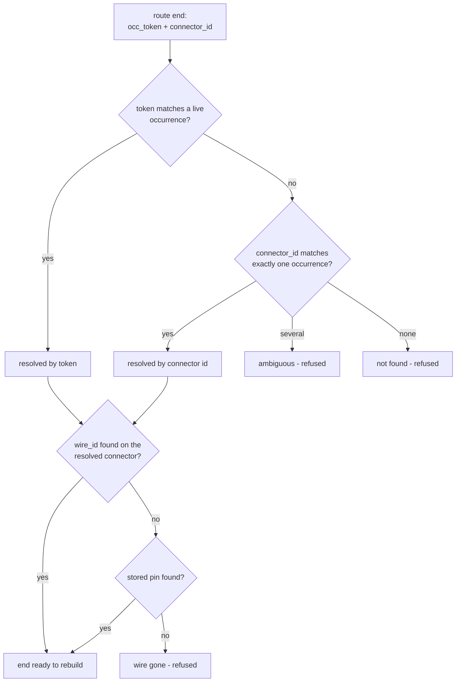

# Update Wire — Architecture
[← Update Wire guide](../Update%20Wire.md)

## Purpose

Third piece of the cable prove-out: the delete-and-rebuild recovery path for
routed wires and cables. Route Wire's geometry is associative (included
connector points), so ordinary moves need nothing; Update Wire exists for
the accepted breakage cases — connector swapped or re-inserted, wire points
redefined, or includes that fell back to baked positions.

## How it works

1. **Collection** — top-level occurrences whose component carries the
   `PowerTools.Cable` / `route` attribute (`builder.collect_routes`, shared
   with Wire Report; `entry._collect_routes` adds kind-prefixed dropdown
   labels). The payload format is defined in
   `commands/cable_shared/routing.py`; both `single` and `cable` kinds rebuild,
   unknown kinds are refused.
2. **Resolution** (`entry._resolve_route` + pure ladder in
   `commands/updatewire/logic.py`, tested in
   `tests/test_updatewire_logic.py`):
   - Candidates: every occurrence in the design except the wire's own tree
     (filtered by `fullPathName` prefix).
   - Each stored end resolves by **entity token** first
     (disambiguates multiple instances of one connector part), else by
     **unique connector id** (token died — document copied or connector
     re-inserted). An ambiguous connector-id match (several instances, dead
     token) is refused rather than guessed. Tokens are resolved through
     `Design.findEntityByToken` and matched to candidates by occurrence
     path — **never by comparing token strings**, which the API documents
     as invalid (the same entity can return different token strings over
     time).
   - The wire record on the resolved connector is found by **wire id**,
     falling back to **pin** (wire redefined by Define Wires). Cable ends
     resolve their whole stored wire list the same way in stored order
     (`logic.match_cable_wires` — original pairing survives pin renames),
     require the connector's cable point, and both ends must resolve
     matching wire counts.
   - Stored name/gauge/diameter are validated by
     `logic.coerce_route_params` (plus `logic.coerce_cable_od_mm` for
     cables); damaged payloads refuse to rebuild.
3. **Delete** (`entry._delete_wire`) — the wire occurrence's
   `timelineObject.parentGroup` is deleted with contents
   (`TimelineGroup.deleteMe(True)`) **only when its name still matches the
   route's own `Wire <name>` / `Cable <name>` label** — build-time grouping
   can fail silently, and a user's manual group containing the occurrence
   plus unrelated features must never be destroyed wholesale. On a name
   mismatch (or when the group is gone), only the assembly occurrence is
   deleted. Nothing is deleted unless resolution fully succeeded.
4. **Rebuild** — `commands/cable_shared/builder.build_wire` or `build_cable`
   with the resolved ends and stored parameters: same construction as
   Route Wire, including fresh associative includes and a fresh route
   attribute with new occurrence tokens.

## Why occurrence tokens are in the route payload

`connector_id` identifies the connector *component*; with two instances of
the same connector part it cannot say which instance a wire attached to.
Route Wire therefore stamps each end with the occurrence's `entityToken`
(schema v1, additive field `occ_token`). Tokens are persistent within the
document lineage but die on copy/re-insert — hence the two-step ladder with
the unique-connector-id fallback. The Autodesk docs warn that "the token
string returned for a specific entity can be different over time", so a
stored token is only ever *resolved* (`findEntityByToken`), never
string-compared against a live token.

## Known limitations (accepted for the prove-out)

- Deleting the timeline group removes everything the user may have manually
  added into it (documented in the user guide).
- A wire whose both plausible connectors are ambiguous cannot be rebuilt —
  the user re-routes manually with Route Wire.
- Icons are placeholders copied from `roundsketchdimensions`.

---

[← Update Wire guide](../Update%20Wire.md)
