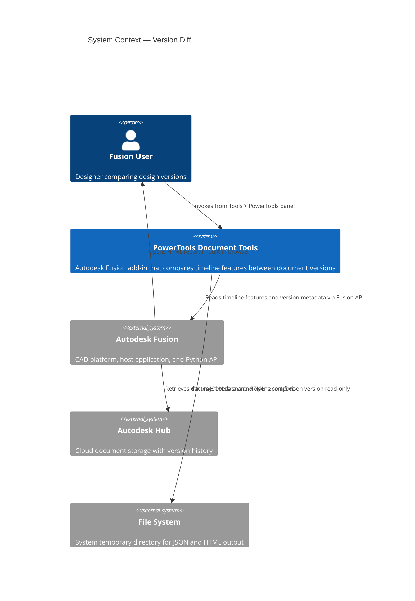
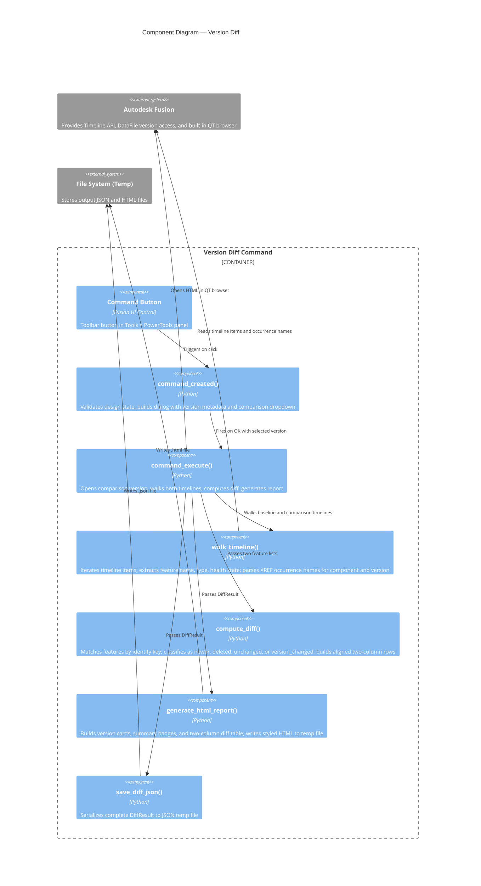
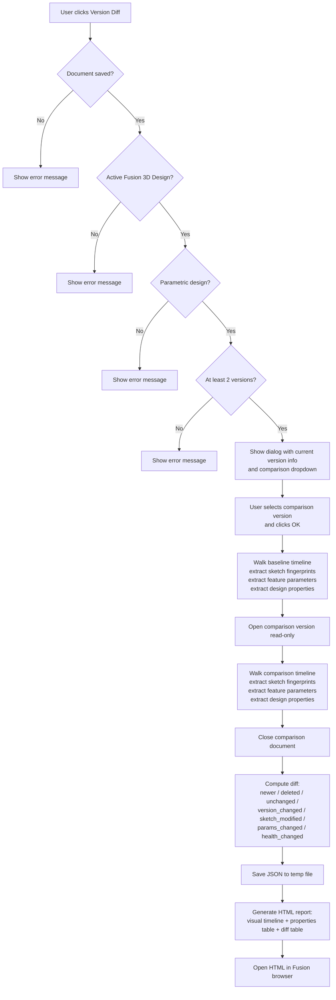
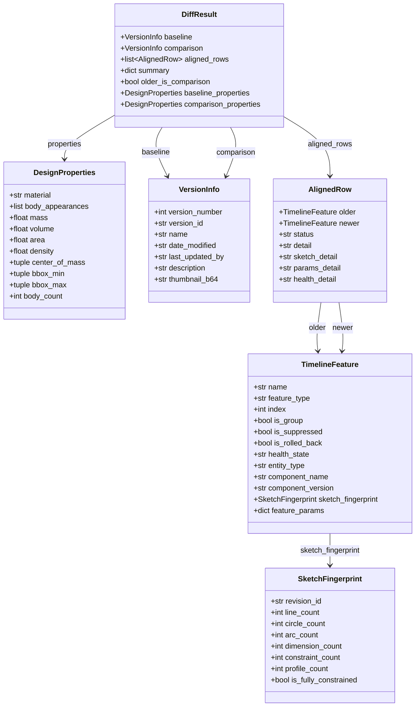

# Version Diff — Architecture

[← Version Diff guide](../Version%20Diff.md)

## Architecture

### System context

The following diagram shows the relationship between the user, the Version Diff command, Autodesk Fusion, and the file system.

### Component diagram

The following diagram shows how the internal components of the command interact during execution.

### Command execution flow

The following diagram shows the step-by-step execution flow when the user runs the Version Diff command.

### Data model

The following diagram shows the relationships between the data structures used in the diff pipeline.

## Authorship

`DataFile` cannot attribute a version. `createdBy` returns the file's creator and `lastUpdatedBy` its last editor, and **every version in the collection answers with those same two names** — verified on a 27-version design saved by nine people, where they returned one name each and different names from each other.

The Version Summary used to report `len({ver.lastUpdatedBy for ver in versions})` as "Contributors", which is one by construction; it read "1 user" for that design. The dropdown carried the same name on every row, and the HTML report shows it on both cards. Those are now labelled "Created By" / "Last Saved By" for what they are, the dropdown carries no name at all, and the per-version read is gone from the scan loop — which also removes a cloud round trip per version from the dialog build.

Per-version authorship is reachable only over MFGDM GraphQL, and not from here: this command builds its dialog in `command_created`, where reading `mfgdmModelId` destabilises Fusion (234b043). `commands/dochistory` does it from a deferred custom event; see [Document History](Document%20History.md).
