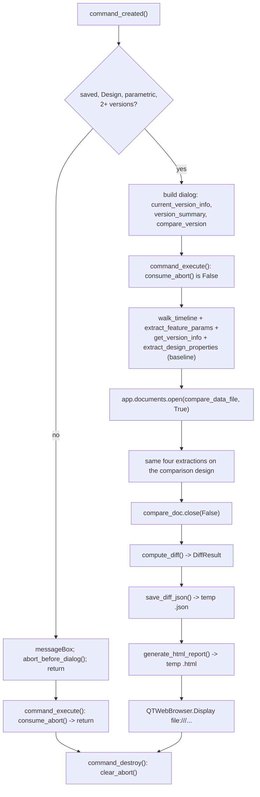

# Version Diff — Architecture

[← Version Diff guide](../Version%20Diff.md)

| | |
|---|---|
| **Command ID** | `PTND_versiondiff` |
| **Registry** | group `document` (`Document Tools`); **ships disabled** (`settings_store.DEFAULT_DISABLED_COMMANDS`) |
| **UI location** | the shared Power Tools panel on the Design workspace **Tools** tab (`_ui_bootstrap.get_power_tools_panel()`, panel id `config.my_panel_id`), `isPromoted = True` |
| **Files** | `commands/versiondiff/entry.py`; `adsk`-free: `timeline_model.py` (dataclasses), `html_report.py` (report renderer), `feature_icons.py` (SVG -> data URI); `adsk`-bound: `timeline_diff.py` (`walk_timeline`, `get_version_info`, `compute_diff`, `save_diff_json`), `param_fingerprint.py`, `sketch_hash.py`, `design_properties.py`; `resources/` (icons, `generate_icons.py`, `feature_icons/` 51 SVGs, `concepts/` design sketches) |
| **Shared helpers** | [`_ui_bootstrap.get_power_tools_panel`](architecture.md#_ui_bootstrap), [`_command_abort`](architecture.md#_command_abort) (`abort_before_dialog`, `consume_abort`, `clear_abort`), [`ptutil.add_handler`](architecture.md#event_utils), [`ptutil.log`](architecture.md#general_utils), [`config`](architecture.md#config) |
| **Tests** | none of its own; `tests/test_command_contract.py`, `tests/test_command_abort.py` |

## Purpose

Compares the active parametric design against any other saved version of the same document and opens an HTML report: version cards, a visual timeline strip, a design-properties table and a two-column feature diff classifying each timeline item as newer, deleted, unchanged, XREF version changed, sketch modified, parameters changed or health changed. The shaping constraint is that the comparison version has to be opened as a second document inside the command, walked, and closed again before the report is built.

## How it is wired

- `start()`: `addButtonDefinition(CMD_ID, ...)`, `command_created` on `commandCreated` (global handler list), `panel.controls.addCommand(cmd_def)` with `isPromoted = True` on the Power Tools panel if it exists.
- `stop()`: deletes the panel control and the definition; errors are logged, not raised.
- `command_created(args)`: resets `_version_map`, then validates in order, each failure showing a message box, calling [`abort_before_dialog(CMD_ID, CMD_NAME, reason)`](architecture.md#aborting-a-command-before-its-dialog) and returning with no inputs built:
  1. `app.activeDocument.isSaved`;
  2. `adsk.fusion.Design.cast(app.activeProduct)` is a design;
  3. `design.designType != DirectDesignType`;
  4. `app.activeDocument.dataFile.versions.count >= 2`.

  Then, under `ui.progressBar.showBusy(...)` (single `adsk.doEvents()` calls between phases, not a loop; `progress.hide()` in `finally`), it builds the dialog: group `current_version_info` (`info_version`, `info_date`, `info_user` "Last Saved By", `info_desc`); collapsed group `version_summary` (`sum_versions`, `sum_created`, `sum_last_saved`, `sum_created_by`, `sum_last_user`, `sum_milestones`, `sum_latest_ms`, `sum_revisions`, `sum_latest_rev`, `sum_public`) computed from one pass over `versions` plus `data_file.milestones` and `sharedLink`; and the dropdown `compare_version` listing every other version newest-first as `V<n> - <date>`, with `_version_map[label] = DataFile`. Finally registers `command_execute`, `on_input_changed` (an empty stub) and `command_destroy`.
- `command_execute(args)`: `consume_abort(CMD_ID, CMD_NAME)` first — a run whose `commandCreated` bailed out is auto-executed with no inputs and would otherwise dereference a missing dropdown. Then:
  1. resolve the selected `DataFile` from `_version_map`;
  2. baseline: `walk_timeline(design.timeline)`, `attach_params_to_features(..., extract_feature_params(design))`, `get_version_info(activeDocument.dataFile)`, `extract_design_properties(design)`;
  3. `compare_doc = app.documents.open(compare_data_file, True)`; design via `compare_doc.products.itemByProductType("DesignProductType")`; the same four extractions;
  4. `compare_doc.close(False)`;
  5. `compute_diff(baseline_features, compare_features)` -> `(diff_entries, aligned_rows, summary)`; `older_is_comparison = compare < baseline` by version number; assemble `DiffResult`;
  6. `save_diff_json(diff_result)` and `generate_html_report(diff_result)`; `app.executeTextCommand(f"QTWebBrowser.Display file:///{html_path}")`.

  Any exception is logged with a traceback and shown in a message box; `finally` closes `compare_doc` if it is still open. Note that the comparison document is opened and closed inside the `execute` event, which is the pattern rule 6 in `AGENTS.md` forbids; the command ships disabled.
- `command_destroy(args)`: `clear_abort(CMD_ID)` (destroy always runs; `consume_abort` only clears the flag when `execute` ran), then resets `local_handlers` and `_version_map`.

No selections are involved, so `capture_selections` is not used; the only input read in `execute` is the dropdown's `selectedItem.name`.

## Data and state

- Module-level: `_version_map` (dropdown label -> `DataFile`, rebuilt per invocation), `local_handlers`.
- Temp files, both in `tempfile.gettempdir()` with a shared `secrets.token_urlsafe(8)` name per run: `version_diff_<token>.json` (`save_diff_json`, `DiffResult.to_json()`), `version_diff_<token>.html` (`generate_html_report`). Paths are returned POSIX-style for the `file:///` URL. Nothing deletes them.
- No settings keys, caches or custom events.

## Pipeline modules

| Module | `adsk` | Role |
|---|---|---|
| `timeline_model.py` | no | `TimelineFeature`, `VersionInfo`, `DiffEntry`, `AlignedRow`, `DiffResult` (+ `to_json`) |
| `timeline_diff.py` | yes | `walk_timeline` (name, type, index, group/suppressed/rolled-back flags, health state string, entity type; XREF occurrence names parsed by `_OCCURRENCE_NAME_RE` `^(.+?)\s+v(\d+):(\d+)$` into `component_name` / `component_version`; sketch fingerprint per sketch), `get_version_info`, `compute_diff` (matches by `_feature_key`, builds `AlignedRow`s and the summary counts), `save_diff_json` |
| `sketch_hash.py` | yes | `SketchFingerprint` (revision id and entity/dimension/constraint/profile counts, fully-constrained flag), `extract_sketch_fingerprint`, `sketch_change_detail` |
| `param_fingerprint.py` | yes | `extract_feature_params` keyed by timeline index, `attach_params_to_features`, `params_differ` (relative tolerance `1e-9`), `param_change_detail` |
| `design_properties.py` | yes | `DesignProperties` (material, appearances, mass, volume, area, density, centre of mass, bounding box, body count), `extract_design_properties` |
| `html_report.py` | no | `generate_html_report`: version cards, filter badges, properties table, SVG visual timeline (`_build_visual_timeline`, fixed box geometry constants), two-column table |
| `feature_icons.py` | no | maps a feature type to an SVG under `resources/feature_icons/` and inlines it as a data URI (`_FALLBACK_ICON = "solid-api.svg"`) |

### Classification

`compute_diff` pairs features by identity key; for a pair present on both sides the status is the first that applies: `version_changed` (XREF, same component, different version), `sketch_modified` (same sketch name, different `revision_id`), `params_changed`, `health_changed`, else `unchanged`. A feature only in the baseline is `newer`; only in the comparison is `deleted`. `summary` carries the counts by status; `DiffEntry.status` uses the first four values and `AlignedRow.status` all seven.

### Authorship

`DataFile` cannot attribute a version: `createdBy` is the file's creator and `lastUpdatedBy` its last editor, and every `DataFileVersion` in the collection answers with those same two names. The dialog therefore shows "Created By" / "Last Saved By" for what they are, the dropdown labels carry no name, and the summary loop reads no per-version author — which also keeps a cloud round trip per version out of the dialog build. Per-version authorship is reachable only over MFGDM GraphQL and is not read here, because reading `mfgdmModelId` inside `command_created` destabilises Fusion; [Document History](Document%20History.md) does it from a deferred custom event.

## Diagram

The execute path, with the second document's lifetime inside it.

```mermaid
flowchart TD
    CC["command_created()"] --> V{"saved, Design, parametric,<br/>2+ versions?"}
    V -- no --> AB["messageBox; abort_before_dialog(); return"]
    AB --> EX0["command_execute(): consume_abort() -> return"]
    V -- yes --> DL["build dialog: current_version_info,<br/>version_summary, compare_version"]
    DL --> EX["command_execute(): consume_abort() is False"]
    EX --> B["walk_timeline + extract_feature_params +<br/>get_version_info + extract_design_properties (baseline)"]
    B --> O["app.documents.open(compare_data_file, True)"]
    O --> C["same four extractions on the comparison design"]
    C --> CL["compare_doc.close(False)"]
    CL --> D["compute_diff() -> DiffResult"]
    D --> J["save_diff_json() -> temp .json"]
    J --> H["generate_html_report() -> temp .html"]
    H --> W["QTWebBrowser.Display file:///..."]
    EX0 --> DS["command_destroy(): clear_abort()"]
    W --> DS
```

## Tests

- `tests/test_command_contract.py` — imports `entry.py` under the `adsk` stub; checks `CMD_Description`, the literal `CMD_ID`, and the registry/doc/README contract.
- `tests/test_command_abort.py` — unit tests for the `_command_abort` flag this command consumes, and the AST guard that no `commandCreated` handler calls `doExecute`.

`entry.py` is Fusion-bound and is not exercised by the suite; nothing here is verified in Fusion on this branch except by the AST guards above, which import it under the `adsk` stub. The `adsk`-free modules (`timeline_model.py`, `html_report.py`, `feature_icons.py`) and `compute_diff` have no unit tests; the icon set is not pinned in `tests/test_command_icons.py`.

## Learnings

- **Per-version `lastUpdatedBy` is file-level, so a "Contributors" count built from it is always 1.** Verified on a 27-version design saved by nine people: `createdBy` and `lastUpdatedBy` returned one name each on every version. The dropdown also repeated that one name on every row. Replaced by the two labelled file-level names and no per-version read (see Authorship above).
- **Do not read `mfgdmModelId` in `command_created`** — it destabilises Fusion (`234b043`); the deferred-event approach in Document History is the working alternative.

---

*Copyright © 2026 IMA LLC. All rights reserved.*
