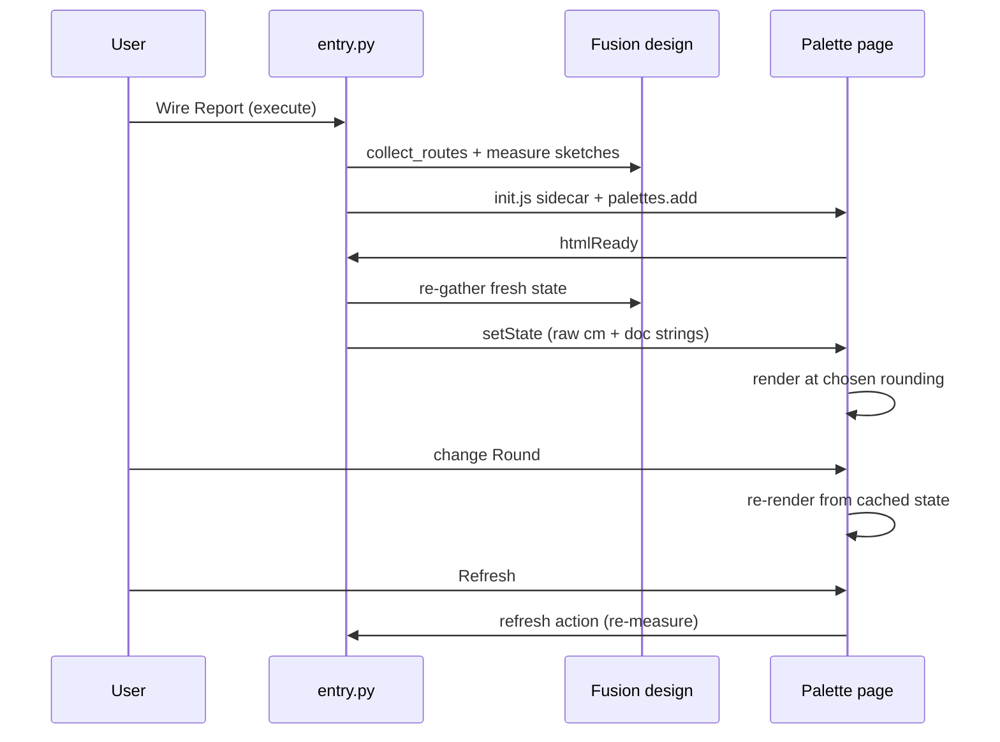

# Wire Report — Architecture
[← Wire Report guide](../Wire%20Report.md)

## Purpose

Read-only consumer of the cable prove-out's data: enumerate routed
assemblies via their `PowerTools.Cable` / `route` attributes
(`cable_shared/builder.collect_routes`, shared with Update Wire), measure
their as-built lengths, and present the result in an HTML palette.

## Measurement

Lengths come from the routing sketches the builder created, not from the
solid bodies: per component, the sum of **non-construction** sketch curve
lengths (`SketchCurve.length`, internal cm). Construction geometry — the
jacket's tangency direction lines — is excluded.

- Single wire: `Conductor` child component (both bare stubs) +
  `Sheath` child component (line + spline + line) = **total wire length**.
- Cable: the `Cable <name>` component's own sketch = jacket run; each
  `Wire <label>` child = that wire's out-of-jacket length (stubs, exit
  lines, fan-out lines). A wire's full path = its own length + the
  jacket; the **cable length = max over wires** (`logic.summarize_cable`
  in `commands/wirereport/logic.py`, unit-tested) — every wire in a
  manufactured cable is cut to the same length, so the longest path
  governs. Wires display by their cable-unique **label** (end-A pin
  unless the CSV assigned one; pins can collide across a multi-connector
  end).

Children are identified by the builder's stamped **member attributes**
(`PowerTools.Cable` / `member`: role conductor/sheath/wire, wire members
carrying their pin and label) — immune to renames and Fusion's
uniqueness suffixes.
For assemblies built before the stamps existed, the fallbacks are the old
ladder: name-prefix discovery, pins by creation order against the route
payload, then component-name parsing; a total miss is logged instead of
silently reporting a zero length.

Connector display names resolve from the route ends' occurrence tokens
(`design.findEntityByToken`), falling back to the stored connector id. A
cable end spanning several connectors (`routing.end_connectors`) shows
them joined, e.g. `J3 + J4`.

Each length travels to the page as **raw cm plus a pre-formatted
document-units string** (`UnitsManager.formatInternalValue`, mm fallback).
The page formats from the raw value using the **Round** control — 1 / 0.1 /
0.00 (default) / 0.000 mm — so changing the rounding re-renders instantly
from cached state with no Fusion round-trip; the "Doc units" option swaps
in the pre-formatted string.

## Palette

Clones the repo's assemblyintent pattern: delete-then-add lifecycle,
`init.js` sidecar for first paint (git-ignored, regenerated per show),
`htmlReady` handshake pushing fresh state, `refresh` action re-measuring
on demand, and external links forced out of the palette. Theme is resolved
Python-side (Fusion preference; OS setting for "device" mode) and applied
as a body class over CSS custom properties (`:root` dark, `body.light`) —
the same variable values the other PowerTools palettes use to mirror
Fusion's UI colors; scrollbars are styled through `::-webkit-scrollbar`
over the same variables (the palette browser is Chromium-based). The page
renders exclusively from a single `setState` JSON payload; all strings are
inserted via `textContent` (no HTML injection from model-derived names).

## Known limitations (accepted for the prove-out)

- Assemblies with broken (failed-recompute) sketches report whatever the
  current sketch state measures.
- Ribbon or future route kinds appear only in the "unsupported routes"
  count.

---

[← Wire Report guide](../Wire%20Report.md)
