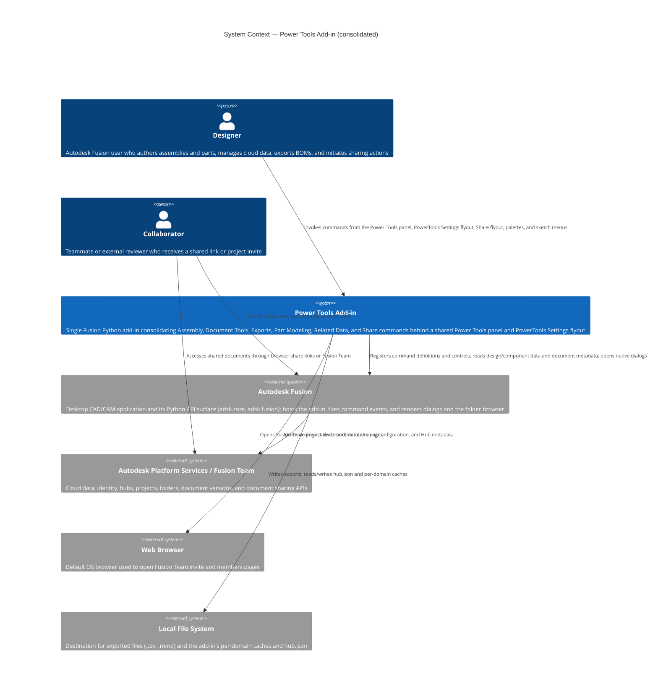
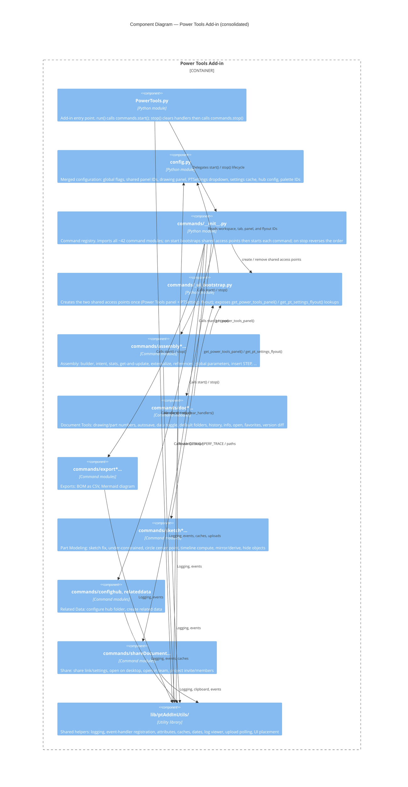
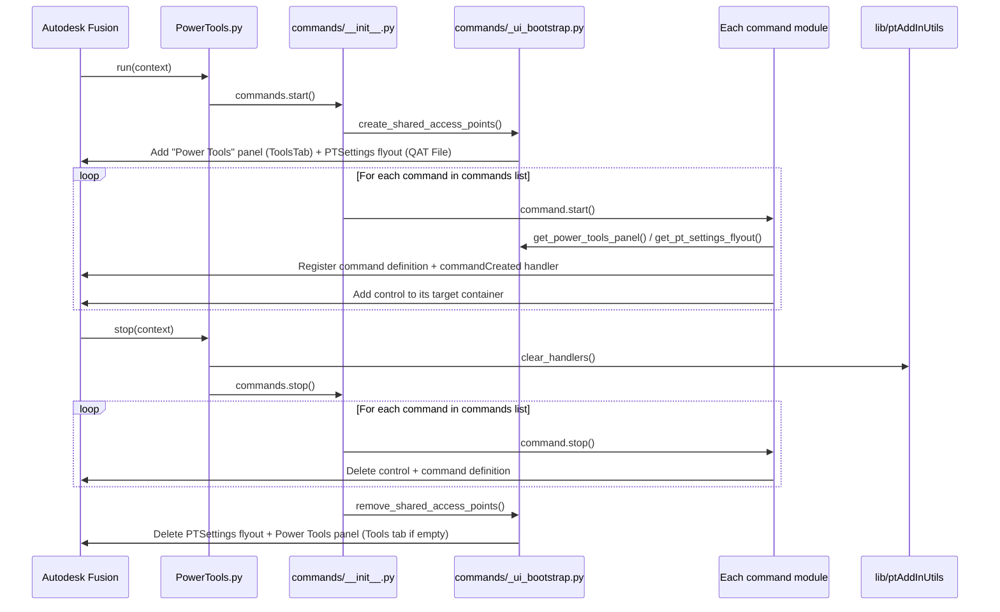
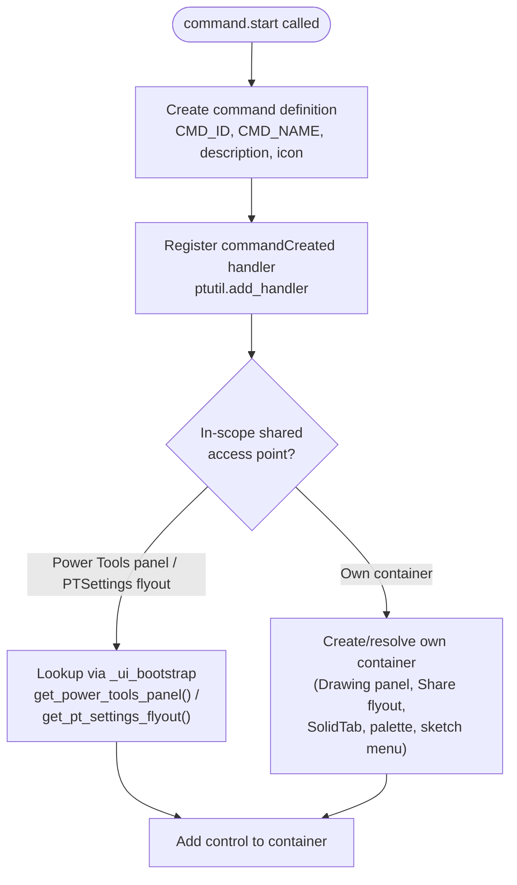
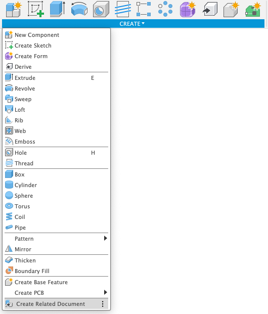
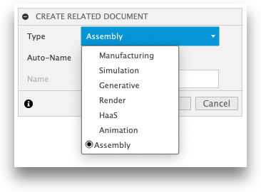
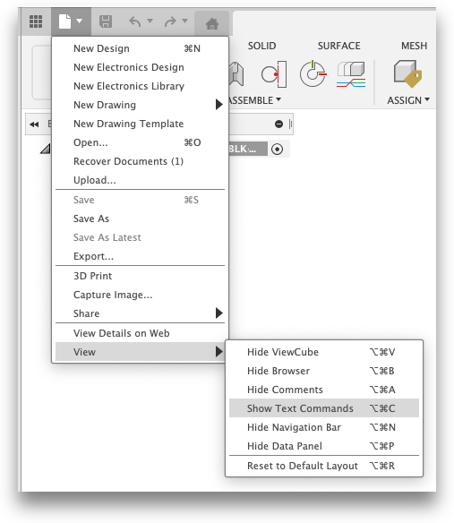
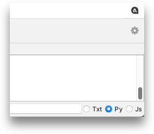
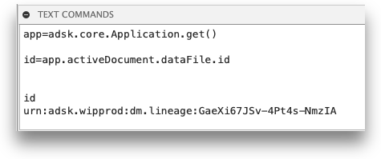

# Architecture

This document describes the internal structure and runtime behavior of the
consolidated **Power Tools** add-in for Autodesk Fusion. It uses the
[C4 model](https://c4model.com/) to represent the system at three levels of
detail: system context, container/component structure, and individual command
flows.

Power Tools is a single Fusion Python add-in built by merging six previously
separate add-ins (Assembly, Document Tools, Exports, Part Modeling, Related
Data, and Share Document) into one installable unit. The ~41 command modules
they contributed now live side by side under a shared entry point, a shared
utility library, and a single merged configuration module.

---

## Contents

- [Architecture](#architecture)
  - [Contents](#contents)
  - [System context](#system-context)
  - [Component structure](#component-structure)
  - [Add-in lifecycle](#add-in-lifecycle)
  - [Shared UI access points](#shared-ui-access-points)
    - [Why the detect-or-create logic was removed](#why-the-detect-or-create-logic-was-removed)
    - [Access points owned by individual commands](#access-points-owned-by-individual-commands)
  - [Command registration](#command-registration)
  - [Command execution model](#command-execution-model)
  - [Shared utility library — `lib/ptAddInUtils`](#shared-utility-library--libptaddinutils)
  - [Configuration module — `config.py`](#configuration-module--configpy)
  - [Data and caches](#data-and-caches)
  - [Architecture diagrams](#architecture-diagrams)
  - [File structure reference](#file-structure-reference)

---

## System context

The following diagram shows the consolidated Power Tools add-in in the context
of its users and the external systems it interacts with. It draws together the
contexts that the six source add-ins each described separately: design and data
management in Fusion, cloud storage and sharing through Autodesk Platform
Services / Fusion Team, browser hand-off for project administration, and the
local file system for exports and caches.



---

## Component structure

The add-in is a flat collection of command modules wired together by a single
command registry. The registry imports every command, creates the shared UI
access points once, then starts each command. All commands share one utility
library and one configuration module.



---

## Add-in lifecycle

Autodesk Fusion calls `run(context)` when the add-in loads and `stop(context)`
when it unloads. `run()` delegates to `commands.start()`; `stop()` first clears
globally-scoped event handlers and then delegates to `commands.stop()`.

`commands.start()` performs the **bootstrap** of the two shared access points
*before* any command registers a control, then starts every command in
registration order. `commands.stop()` reverses this: each command removes its
own controls first, then the shared access points are removed last (when they
are empty).



---

## Shared UI access points

Two UI containers are genuinely **shared** by commands from more than one of the
merged domains:

| Access point | Location | Created by | Looked up by |
|---|---|---|---|
| **Power Tools panel** | Design workspace (`FusionSolidEnvironment`), Tools tab (`ToolsTab`), panel `PT_Power Tools` | `_ui_bootstrap.create_shared_access_points()` | `get_power_tools_panel()` |
| **PTSettings flyout** | QAT File dropdown (`FileSubMenuCommand`), dropdown `PTSettings` ("PowerTools Settings") | `_ui_bootstrap.create_shared_access_points()` | `get_pt_settings_flyout()` |

`commands/_ui_bootstrap.py` creates both exactly once at start-up and removes
both exactly once at shut-down. In-scope commands obtain the already-created
container with a plain `itemById` lookup and add their control directly — there
is no per-command branch that decides whether to create the container.

### Why the detect-or-create logic was removed

In the original, separately-installable add-ins, several add-ins each shipped
their own copy of the Power Tools panel and the PowerTools Settings flyout.
Because a user could install any subset of them in any order, every command had
to **detect** whether a sibling add-in had already created the shared container
and create it only if it was missing (a "get-or-create" pattern). Symmetrically,
teardown had to delete the container only when it was the last occupant.

This was necessary defensive logic when ownership was distributed, but it had
costs: the create-or-detect branch was duplicated across many commands, the
delete-if-empty bookkeeping was easy to get subtly wrong, and the panel/flyout
IDs had to stay identical across independently-versioned repos.

Now that a **single** consolidated add-in owns every command, container
ownership is centralized:

- `create_shared_access_points()` runs once before any command starts, so the
  panel and flyout are *guaranteed* to exist by the time a command registers.
- Commands call `get_power_tools_panel()` / `get_pt_settings_flyout()` — pure
  lookups with no create branch (callers still guard with `if panel:` for the
  edge case where a workspace or the QAT is unavailable).
- `remove_shared_access_points()` runs once after every command has removed its
  own control, so the containers are empty and can be deleted unconditionally
  (the Tools tab is deleted only if no panels remain on it).

The legacy `get_or_create_pt_settings_dropdown()` helper is retained in
`config.py` for compatibility, but the bootstrap path is the one exercised at
runtime.

### Access points owned by individual commands

Only the two access points above are shared. Every other UI location is still
created and torn down by the individual command that uses it:

| Location | Owner domain | Notes |
|---|---|---|
| Drawing-tab panel `PT_DrawingPowerTools` | Document Tools | On the built-in `FusionDocTab` of the Drawing workspace; the tab itself is never created or deleted. |
| QATRight "Share" flyout `shareDropMenu` | Share | Right Quick Access Toolbar drop-down for the Share commands. |
| SolidTab panels / sketch & modify menus | Part Modeling, Assembly | Context-specific placement near sketch and modify tools. |
| Assembly palettes (`*_assembly_builder_palette`, `*_assembly_intent_palette`) | Assembly | Palette IDs derived from company + add-in name in `config.py`. |

---

## Command registration

Each command module exposes `start()` / `stop()` and follows a consistent
registration pattern during `start()`:

1. Create a command definition (typically a `ButtonCommandDefinition`) with an
   ID, display name, description, and icon folder path.
2. Register a `commandCreated` event handler via `ptutil.add_handler()`.
3. Resolve the target container: a shared lookup
   (`get_power_tools_panel()` / `get_pt_settings_flyout()`) for in-scope
   commands, or the command's own container for the others.
4. Add the control to that container, optionally positioned relative to a
   sibling control.



A few ordering constraints are encoded in the `commands` list in
`commands/__init__.py`:

- `insertSTEP` must start before `assemblyintent` — the New Assembly launch
  button positions itself relative to the Insert STEP control.
- The Share commands keep their original relative order for correct QATRight
  flyout positioning.
- `scriptsmanager` (Tools group) positions its QAT File-menu control directly
  before the `PT-preferences` control. The Preferences command is infrastructure
  and always starts before the registry commands, so the anchor is present; the
  command falls back to appending if it is ever missing.

---

## Command execution model

When the user selects a command, Fusion fires `commandCreated`. The handler
connects the `execute` and `destroy` events. Commands that present no dialog
inputs execute immediately after creation; commands that show a dialog or
palette execute when the user confirms.

```mermaid
sequenceDiagram
    participant User
    participant Fusion as Autodesk Fusion
    participant Handler as command_created handler
    participant Execute as command_execute handler
    participant Destroy as command_destroy handler

    User->>Fusion: Selects a Power Tools command
    Fusion->>Handler: commandCreated event
    Handler->>Fusion: Register execute handler
    Handler->>Fusion: Register destroy handler
    Fusion->>Execute: execute event
    Execute->>Execute: Validate preconditions (e.g. isSaved)
    Execute->>Execute: Perform command action (read design, write file, open URL, …)
    Execute->>Fusion: Return
    Fusion->>Destroy: destroy event
    Destroy->>Destroy: Clear local_handlers list
```

> Some long-running operations (for example assembly externalization and
> upload-bound saves) defer their work into a `CustomEvent` handler that fires
> *after* the command dialog closes, because Fusion's upload pipeline does not
> advance while a command with `CommandInputs` holds the main thread.
> `ptutil.upload_utils.wait_for_upload()` polls such saves to completion.

---

## Shared utility library — `lib/ptAddInUtils`

`lib/ptAddInUtils/` is the single shared helper package for the whole add-in
(formerly `fusionAddInUtils` in the separate add-ins). Its `__init__.py`
re-exports the public names from eight modules — `general_utils` is imported
first because it defines the `app` / `ui` objects that the other modules rely
on. Commands import it as `ptutil`.

| Module | Provides |
|---|---|
| `general_utils.py` | `log()`, `clipText()`, `isSaved()`, `handle_error()`, `perf_timer()`. Logging is gated on `config.DEBUG`; `perf_timer` is gated on `config.PERF_TRACE`. |
| `event_utils.py` | `add_handler()` (registers a handler and retains it against GC), `clear_handlers()` (releases globally-scoped handlers at stop). |
| `attributes_utils.py` | Attribute enumeration/formatting helpers (`attributes_for_selection`, `get_all_attributes`, `get_comptypes`, `update_feedback_from_list`). |
| `cache_utils.py` | Project/folder/param-doc JSON cache helpers (Global Parameters and Related Data domains); active-project / target-folder resolution shared by the assembly commands (`get_active_project`, `resolve_target_folder`, `target_project_label`). |
| `date_utils.py` | `next_business_day(dt)`, `compute_quick_dates()`. |
| `log_utils.py` | `default_log_directory()`, `open_live_log_viewer(path)`. |
| `upload_utils.py` | `wait_for_upload(save_result, context_label, …)` — polls a Fusion save/upload to completion. |
| `ui_utils.py` | Generic panel/flyout placement helpers (`get_or_create_panel`, `remove_from_panel`, `get_or_create_qat_file_flyout`, `get_or_create_qat_right_flyout`, …) used by commands that own their own containers. |

Key behavior worth noting for developers:

- **`log()` is fully gated on `config.DEBUG`.** When `DEBUG` is `False`, logging
  produces no output at all — not to stdout, the Fusion log file, or the **Text
  Commands** window. Because `handle_error()` logs through `log()`, error
  traces are also `DEBUG`-gated (it can still optionally show a message box).
- **Event handlers must be retained.** `add_handler()` appends the handler to a
  module-level list so it is not garbage-collected; `clear_handlers()` (called
  from `PowerTools.stop()`) releases them on unload.
- **Active-project access is centralized and defensive.** `app.data.activeProject`
  raises `InternalValidationError('id.size()')` when the Data Panel has no project
  in context (showing the hub root, or the data layer left in a bad state — the
  same error family as `safe_activate`'s already-active `activate()`). Commands
  resolve it through `cache_utils.get_active_project()` / `resolve_target_folder()`
  instead of touching it directly. Because a raise inside a palette
  `incomingFromHTML` handler is swallowed by the `DEBUG`-gated `handle_error()`,
  an unguarded call there surfaced as "nothing happens"; the assembly palettes now
  present an unresolved project as a **no target project** banner and disable
  component creation until the user selects one (re-checked on demand — Fusion
  exposes no active-project-changed event).

---

## Configuration module — `config.py`

`config.py` is a single merged module that replaces the per-add-in `config.py`
files. It is organized into the following sections:

| Section | Key names | Purpose |
|---|---|---|
| 1. Global flags / identity | `DEBUG`, `PERF_TRACE`, `ADDIN_NAME`, `COMPANY_NAME`, `ADDIN_PATH`, `CACHE_PATH` | Master logging/perf gates, add-in and company identity, root and cache paths. |
| 2. Shared Power Tools panel | `design_workspace`, `tools_tab_id`, `my_tab_name`, `my_panel_id`, `my_panel_name`, `my_panel_after` | IDs for the shared Tools-tab panel created by the bootstrap. |
| 3. Drawing workspace | `drawing_workspace`, `drawing_tab_id`, `drawing_panel_id`, `drawing_panel_name`, `drawing_panel_after` | Document Tools panel on the built-in Drawing tab. |
| 4. PTSettings dropdown | `PT_SETTINGS_DROPDOWN_ID`, `PT_SETTINGS_DROPDOWN_NAME`, `get_or_create_pt_settings_dropdown()`, `remove_from_pt_settings_dropdown()` | The shared QAT File-menu flyout (created by the bootstrap; helpers retained for compatibility). |
| 5. Settings cache | `CACHE_DIR`, `SETTINGS_FILE`, `load_settings()`, `save_settings()` | JSON settings store under `cache/` (Document Tools). |
| 6. Hub configuration | `COMPANY_HUB`, `COMPANY_HUB_CONFIGS`, `loadHub()`, `reload_hub_config()` | Loads `hub.json` into in-memory hub/project/folder config (Related Data). |
| 7. Palette IDs | `assembly_builder_palette_id`, `assembly_intent_palette_id` | Assembly palette IDs derived from company + add-in name. |

`DEBUG` is not hard-coded: it is set to the presence of a `.debug` marker file
in the add-in root (`DEBUG = os.path.isfile(.../.debug)`). To enable verbose
logging, a developer creates an empty `.debug` file next to `config.py` and
reloads the add-in; deleting the file turns logging back off. The marker is
git-ignored, so a distribution (which has no `.debug` file) always runs with
`DEBUG` `False`. `PERF_TRACE` enables `[PERF]` timing lines from `perf_timer`
and is useful for diagnosing slow Hub operations in the Global Parameters
commands.

---

## Data and caches

| Path | Owner | Contents |
|---|---|---|
| `cache/settings.json` | Document Tools | User settings (`load_settings()` / `save_settings()`). |
| `cache/[hub-id].json` | Related Data | Per-hub template cache. |
| `hub.json` | Related Data | Registered hub IDs, project IDs, and folder IDs (loaded by `loadHub()`). |

Per-domain caches live under the add-in's single `cache/` directory
(`config.CACHE_PATH`). `hub.json` lives at the add-in root and is read at import
time and re-read by `reload_hub_config()` after it is written.

---

## Architecture diagrams

The following reference renders capture the high-level structure of the
consolidated add-in. They are stored in `assets/` and may be regenerated as the
structure evolves.

| Diagram | File |
|---|---|
| Context overview |  |
| Container / component view |  |
| Command registry and lifecycle |  |
| Command execution detail |  |
| Utility library |  |
| Configuration and data |  |

---

## File structure reference

```
PowerTools/
├── PowerTools.py                 # Add-in entry point (run / stop)
├── PowerTools.manifest
├── config.py                     # Merged configuration (7 sections)
├── hub.json                      # Related Data hub configuration (optional)
├── cache/                        # Per-domain caches (settings.json, [hub-id].json)
├── commands/
│   ├── __init__.py               # Command registry; bulk start()/stop() around bootstrap
│   ├── _ui_bootstrap.py          # Creates/removes the two shared access points
│   ├── assemblybuilder/ … refresh/        # Assembly command modules
│   ├── assigndrawingnumber/ … versiondiff/ # Document Tools command modules
│   ├── exportbomcsv/, exportmermaid/       # Exports command modules
│   ├── sketchfix/ … hideobjects/           # Part Modeling command modules
│   ├── confighub/, relateddata/            # Related Data command modules
│   └── shareDocument/ … projectMembers/    # Share command modules
├── lib/
│   └── ptAddInUtils/             # Shared utility package
│       ├── __init__.py           # Re-exports all helper names (general_utils first)
│       ├── general_utils.py      # log(), clipText(), isSaved(), handle_error(), perf_timer()
│       ├── event_utils.py        # add_handler(), clear_handlers()
│       ├── attributes_utils.py   # attribute enumeration/formatting helpers
│       ├── cache_utils.py        # project/folder/param-doc JSON cache helpers
│       ├── date_utils.py         # next_business_day(), compute_quick_dates()
│       ├── log_utils.py          # default_log_directory(), open_live_log_viewer()
│       ├── upload_utils.py       # wait_for_upload()
│       └── ui_utils.py           # panel/flyout placement helpers
├── docs/                         # End-user / command documentation
└── docs_arch/
    ├── architecture.md           # This document
    ├── index.md                  # Architecture documentation index
    └── assets/                   # 000-CDD.png … 005-CDD.png
```

---

*Copyright © 2026 IMA LLC. All rights reserved.*
