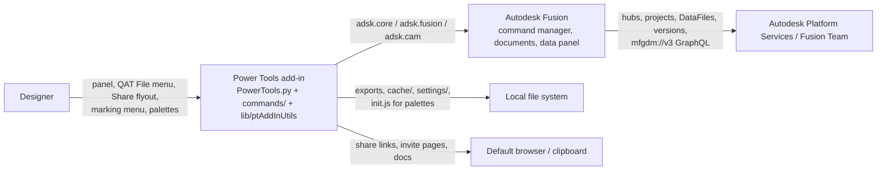
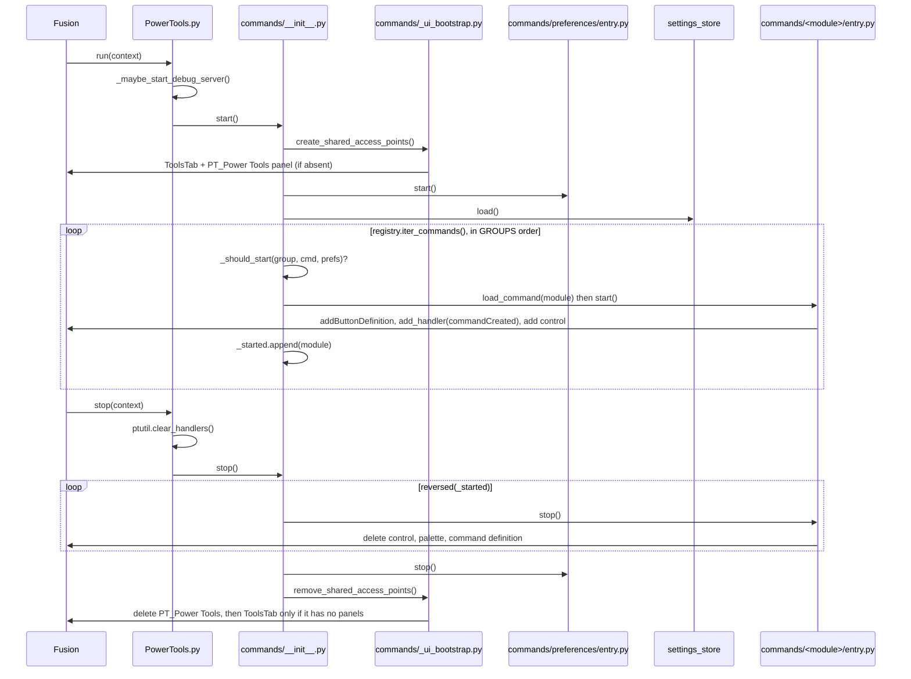
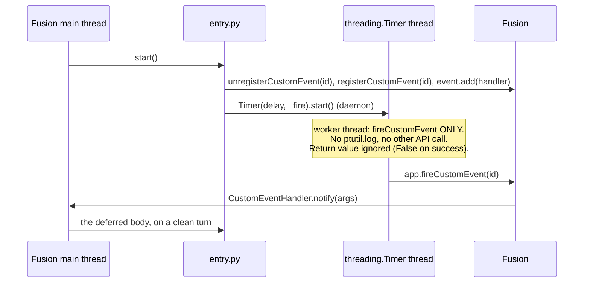
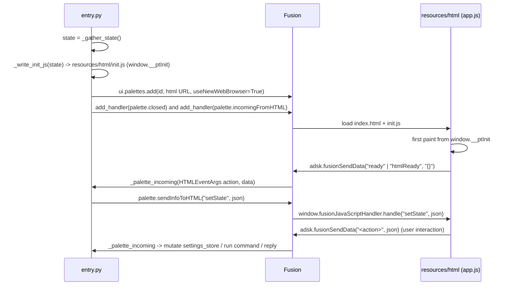
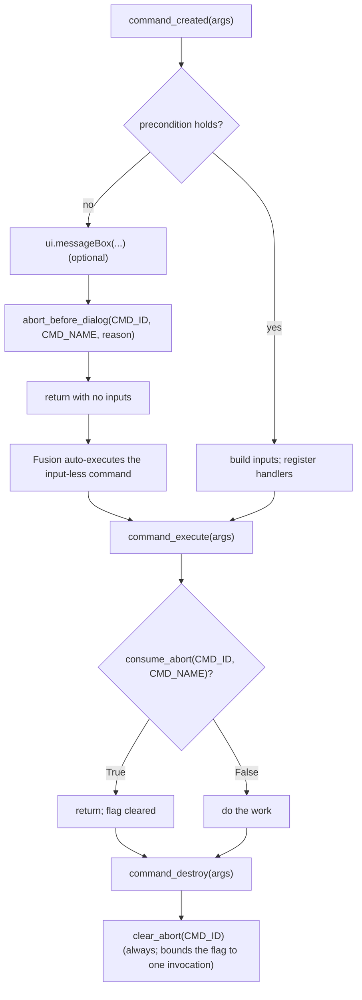
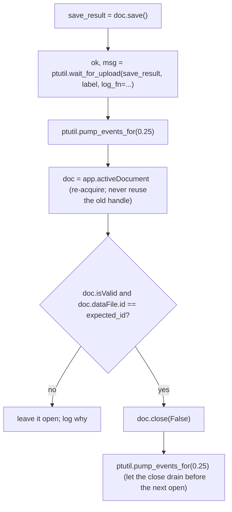
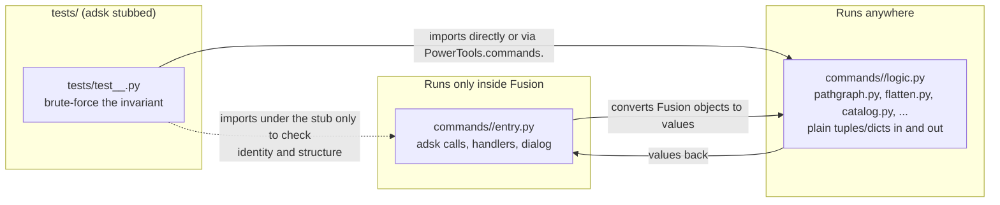

# Architecture

How the **Power Tools** add-in for Autodesk Fusion is put together on this
branch: the entry point and lifecycle, the command-module pattern every
command follows, the patterns commands share for deferral, palettes, aborts
and waits, and a reference for every shared module. Per-command notes live
beside this file and are listed in [`index.md`](index.md). The mistakes ledger
is [`../dev/lessons.md`](../dev/lessons.md); the search-less index is
[`../dev/codebase-map.md`](../dev/codebase-map.md).

Nothing in this document is verified inside Fusion by the test suite: the
suite stubs `adsk` and proves pure logic only (see
[Testing](../dev/index.md#testing)).

---

## Contents

- [System context](#system-context)
- [Layout](#layout)
- [Add-in lifecycle](#add-in-lifecycle)
- [The command module](#the-command-module)
  - [Command execution model](#command-execution-model)
  - [Acting from `commandCreated` when there are no inputs](#acting-from-commandcreated-when-there-are-no-inputs)
- [Patterns commands share](#patterns-commands-share)
  - [Deferring work to a later main-loop turn](#deferring-work-to-a-later-main-loop-turn)
  - [Palette to Python RPC](#palette-to-python-rpc)
  - [Aborting a command before its dialog](#aborting-a-command-before-its-dialog)
  - [Waiting without freezing Fusion](#waiting-without-freezing-fusion)
  - [The pure-logic split](#the-pure-logic-split)
  - [Custom graphics](#custom-graphics)
- [Shared modules](#shared-modules)
  - [Root modules](#root-modules): [`command_registry`](#command_registry), [`settings_store`](#settings_store), [`config`](#config)
  - [Command infrastructure](#command-infrastructure): [`commands/__init__`](#commands__init__), [`_ui_bootstrap`](#_ui_bootstrap), [`_command_abort`](#_command_abort), [`_inspect_panels`](#_inspect_panels), [`partnumber_shared`](#partnumber_shared)
  - [`lib/ptAddInUtils` (`ptutil`)](#libptaddinutils-ptutil): [`general_utils`](#general_utils), [`event_utils`](#event_utils), [`selection_utils`](#selection_utils), [`json_utils`](#json_utils), [`ui_utils`](#ui_utils), [`cache_utils`](#cache_utils), [`upload_utils`](#upload_utils), [`recents_utils`](#recents_utils), [`fusion_recents`](#fusion_recents), [`intent_icons`](#intent_icons), [`log_utils`](#log_utils), [`attributes_utils`](#attributes_utils), [`date_utils`](#date_utils)
- [UI access points](#ui-access-points)
- [State on disk](#state-on-disk)

---

## System context

Power Tools is one Fusion Python add-in. Fusion hosts it, fires its events and
renders its dialogs and palettes; everything the add-in touches beyond Fusion
is reached either through Fusion's API (cloud data, MFGDM GraphQL) or through
the local machine (files, the clipboard, the default browser).


```mermaid
flowchart LR
    user["Designer"] -- "panel, QAT File menu, Share flyout,<br/>marking menu, palettes" --> addin["Power Tools add-in<br/>PowerTools.py + commands/ + lib/ptAddInUtils"]
    addin -- "adsk.core / adsk.fusion / adsk.cam" --> fusion["Autodesk Fusion<br/>command manager, documents, data panel"]
    fusion -- "hubs, projects, DataFiles, versions,<br/>mfgdm://v3 GraphQL" --> cloud["Autodesk Platform Services / Fusion Team"]
    addin -- "exports, cache/, settings/,<br/>init.js for palettes" --> disk["Local file system"]
    addin -- "share links, invite pages, docs" --> browser["Default browser / clipboard"]
```

---

## Layout

```
PowerTools/
├── PowerTools.py               # run() / stop(); starts the debugpy server when .debug is present
├── PowerTools.manifest         # version and editEnabled are stamped at release time
├── config.py                   # flags, UI ids, workspace probes, hub config, palette ids, settings paths
├── command_registry.py         # GROUPS: the single list of commands; no adsk import
├── settings_store.py           # settings/preferences.json; defaults derived from the registry
├── commands/
│   ├── __init__.py             # start()/stop(): bootstrap, preferences, then gated registry loop
│   ├── _ui_bootstrap.py        # creates/removes the shared Power Tools panel
│   ├── _command_abort.py       # bail out of commandCreated without doExecute
│   ├── _inspect_panels.py      # discovers Fusion's Inspect panels at runtime
│   ├── preferences/            # infrastructure command; always started first
│   ├── partnumber_shared/      # library shared by the three part/drawing-number commands
│   └── <module>/               # one folder per registered command (55 of them)
│       ├── __init__.py         # copyright header only
│       ├── entry.py            # start()/stop(), CMD_ID, CMD_NAME, CMD_Description, handlers
│       ├── <pure>.py           # optional adsk-free logic (logic.py, pathgraph.py, ...)
│       └── resources/          # icons (+ generate_icons.py), html/ for palettes
├── lib/ptAddInUtils/           # shared helpers, imported as ptutil
├── cache/                      # runtime caches (git-ignored)
├── settings/                   # preferences.json (git-ignored)
├── docs/                       # user guides (ship); docs/arch and docs/dev (do not ship)
├── tests/                      # pytest suite; adsk is stubbed in conftest.py
└── tools/                      # release zip, README.pdf, icon renderer, debug-path repointer
```

Command folders sit directly under `commands/`; a nested folder breaks the
relative imports and the whole add-in fails to load
([lessons](../dev/lessons.md#command-lifecycle)).

---

## Add-in lifecycle

Fusion calls `run(context)` on load and `stop(context)` on unload. Both live in
`PowerTools.py` and delegate to `commands.start()` / `commands.stop()`.


```mermaid
sequenceDiagram
    participant Fusion
    participant Entry as PowerTools.py
    participant Cmds as commands/__init__.py
    participant Boot as commands/_ui_bootstrap.py
    participant Prefs as commands/preferences/entry.py
    participant Store as settings_store
    participant Cmd as commands/<module>/entry.py

    Fusion->>Entry: run(context)
    Entry->>Entry: _maybe_start_debug_server()
    Entry->>Cmds: start()
    Cmds->>Boot: create_shared_access_points()
    Boot->>Fusion: ToolsTab + PT_Power Tools panel (if absent)
    Cmds->>Prefs: start()
    Cmds->>Store: load()
    loop registry.iter_commands(), in GROUPS order
        Cmds->>Cmds: _should_start(group, cmd, prefs)?
        Cmds->>Cmd: load_command(module) then start()
        Cmd->>Fusion: addButtonDefinition, add_handler(commandCreated), add control
        Cmds->>Cmds: _started.append(module)
    end

    Fusion->>Entry: stop(context)
    Entry->>Entry: ptutil.clear_handlers()
    Entry->>Cmds: stop()
    loop reversed(_started)
        Cmds->>Cmd: stop()
        Cmd->>Fusion: delete control, palette, command definition
    end
    Cmds->>Prefs: stop()
    Cmds->>Boot: remove_shared_access_points()
    Boot->>Fusion: delete PT_Power Tools, then ToolsTab only if it has no panels
```

The details that matter:

- **Gating happens once, at start.** `_should_start()` reads the memoised
  `settings_store.load()`: the group must be enabled, a beta command needs
  `general.beta_mode`, and a member of a `COMMAND_SETS` set is gated by its
  lead's flag. A change in Preferences applies on the next Fusion restart.
- **Imports are lazy.** `load_command(module)` imports
  `commands.<module>.entry` only when the command is about to start (or when
  the Preferences palette introspects it). A module that fails to import
  costs that one command, not the add-in; the error goes through
  `ptutil.handle_error`.
- **`preferences` is not in the registry.** It is imported eagerly and
  started before the loop so the user can always re-enable what they turned
  off. Its `CMD_ID` (`PT_preferences`) is an anchor other QAT commands
  position against.
- **Teardown is newest-first and only for what started** (`_started`). Every
  `start()`/`stop()` is idempotent and sweeps stale controls, so an add-in
  reload without a Fusion restart leaves nothing behind.
- **The debugger is optional.** With the `.debug` marker present
  `_maybe_start_debug_server()` starts an in-process `debugpy` listener on
  `config.DEBUGGER_PORT` (5678); without it the call returns immediately. See
  [`../dev/debugging.md`](../dev/debugging.md).

---

## The command module

Every registered command is a folder under `commands/` whose `entry.py`
exposes the same surface. `commands/__init__.py` calls only `start()` and
`stop()`; the registry supplies the folder name and the doc filename; the
Preferences palette and the contract test read the three constants.

| Name | Role |
|---|---|
| `CMD_ID` | Fusion command-definition id. Literal, `PT<prefix>_<name>`, underscores only. Three commands build it from `config.COMPANY_NAME` and so contain a space; they are allowlisted in `tests/test_command_contract.py`, not fixed, because renaming a `CMD_ID` orphans users' QAT pins. |
| `CMD_NAME` | Button label. |
| `CMD_Description` | Tooltip and Preferences summary. Exact casing; ASCII; text from `docs/<Doc>.md`. |
| `start()` | Create the command definition, register `commandCreated` with [`ptutil.add_handler`](#event_utils), resolve the container, add the control. |
| `stop()` | Remove the control, any palette, any custom event, then the definition. |
| `local_handlers` | Per-command list passed to `add_handler(..., local_handlers=...)` so handlers created inside one invocation are released in `command_destroy`. |

Containers are resolved in one of four ways: the shared panel from
[`_ui_bootstrap.get_power_tools_panel()`](#_ui_bootstrap); a command-owned
panel on a built-in tab (Drawing, Manage, Animation) that the command creates
and removes; the QAT File dropdown or QATRight through [`ui_utils`](#ui_utils);
or the Inspect panels through [`_inspect_panels`](#_inspect_panels). The full
map is in [UI access points](#ui-access-points).

### Command execution model

Selecting a control makes Fusion fire `commandCreated`. The handler builds the
dialog (if any) and connects the per-invocation handlers with
`ptutil.add_handler(..., local_handlers=local_handlers)`:

| Event | Handler name used in this repo | Used for |
|---|---|---|
| `commandCreated` | `command_created` (a few commands use other names; the AST guard resolves them by registration, not by name) | Build inputs; precondition checks; for input-less commands, the work itself |
| `inputChanged` | `command_input_changed` / `on_input_changed` | React to edits; capture selections with [`capture_selections`](#selection_utils) |
| `validateInputs` | `command_validate_inputs` | Gate OK; second place selections may be captured |
| `executePreview` | `command_execute_preview` | The only place custom graphics are created; preview-driven edits |
| `execute` | `command_execute` | Commit; `consume_abort()` first when the abort pattern is in use |
| `destroy` | `command_destroy` | `clear_abort()`, clear graphics, `local_handlers.clear()` |
| `preSelect`, `mouseUp`, `mouseClick`, `mouseMove` | `command_pre_select`, `command_mouse_*` | Selection filtering and viewport picking (Measure Path, RadialHoleCircle) |

Long work that must outlive the dialog is deferred into a `CustomEvent`
handler (Externalize fires its runner event from `command_execute`; Fusion's
upload pipeline does not advance while a command with `CommandInputs` holds
the main thread). Handlers registered without `local_handlers` go to the
module-level list that `PowerTools.stop()` releases with `clear_handlers()`.

### Acting from `commandCreated` when there are no inputs

Fusion runs a command through a document-scoped pipeline: with no document
open the control is live and `commandCreated` fires, but the command ends
without ever raising `execute`. Nothing raises, so nothing is logged. A
command reachable from the QAT File dropdown on the start screen therefore
does its work in `commandCreated` and registers no `execute` handler:
`closealldocuments`, `datatoggle`, `scriptsmanager`, `preferences`,
`exportsysml`, `refresh`, and the items of the `openrecent` flyout.
`tests/test_exportsysml_entry.py::test_no_execute_handler_is_registered` pins
the shape for one of them. The `execute`-handler commands that remain
(`autosave`, `exportbomcsv`, `exportmermaid`, `favorites`) all operate on the
active document, so the no-document case cannot arise for them.

`commandCreated` is also where a document may be closed: the API does not
support closing a document inside a command-related event, so Close All
Documents and Document Refresh close from there and pump events after each
close.

---

## Patterns commands share

### Deferring work to a later main-loop turn

Two things need a *later* turn of Fusion's main loop rather than the current
one: starting a Fusion command from a palette `incomingFromHTML` handler (the
command is torn down when the HTML event finishes), and running anything on
Fusion's launch path (Team Add-ins reads the hub 25 s after start-up). Firing a
custom event inline does not defer — Fusion dispatches it in the same turn — so
the fire happens from a `threading.Timer`.


```mermaid
sequenceDiagram
    participant Main as Fusion main thread
    participant Cmd as entry.py
    participant Timer as threading.Timer thread
    participant Fusion

    Main->>Cmd: start()
    Cmd->>Fusion: unregisterCustomEvent(id), registerCustomEvent(id), event.add(handler)
    Cmd->>Timer: Timer(delay, _fire).start()  (daemon)
    Note over Timer: worker thread: fireCustomEvent ONLY.<br/>No ptutil.log, no other API call.<br/>Return value ignored (False on success).
    Timer->>Fusion: app.fireCustomEvent(id)
    Fusion->>Main: CustomEventHandler.notify(args)
    Main->>Cmd: the deferred body, on a clean turn
```

Implementations: `commands/teamaddins/entry.py` (`_register_check_event`,
`_schedule_check`, `_fire_check`, `_run_startup_check`),
`commands/assemblypalette/entry.py` (post-insert chain and the thumbnail pump),
`commands/dochistory/entry.py` (deferred load, document switch, thumbnail
pump), `commands/matchunits/entry.py` (two independent deferrals, one per
trigger). Custom event ids are `PT*_` literals recorded in
`tests/test_command_contract.py::KNOWN_NON_COMMAND_PT_LITERALS`. The full
recipe, including how to tell whether the command actually started, is
[Insert and position a component from a palette](../dev/Insert%20and%20position%20a%20component%20from%20a%20palette.md).

The same custom-event mechanism, without the timer, is how a mouse handler
escapes its own stack (`sketchcirclecenterpoint.custom_event_commit`) and how
Externalize moves its batch out of the dialog (`PTAT_externalize_runner`,
fired from `command_execute`).

### Palette to Python RPC

Five commands own an HTML palette: `assemblybuilder`, `assemblypalette`,
`dochistory`, `preferences`, `teamaddins`. All follow the same shape; the
Preferences command is the smallest complete example.


```mermaid
sequenceDiagram
    participant Py as entry.py
    participant Fusion
    participant Page as resources/html (app.js)

    Py->>Py: state = _gather_state()
    Py->>Py: _write_init_js(state)  -> resources/html/init.js (window.__ptInit)
    Py->>Fusion: ui.palettes.add(id, html URL, useNewWebBrowser=True)
    Py->>Fusion: add_handler(palette.closed) and add_handler(palette.incomingFromHTML)
    Fusion->>Page: load index.html + init.js
    Page->>Page: first paint from window.__ptInit
    Page->>Fusion: adsk.fusionSendData("ready" | "htmlReady", "{}")
    Fusion->>Py: _palette_incoming(HTMLEventArgs action, data)
    Py->>Fusion: palette.sendInfoToHTML("setState", json)
    Fusion->>Page: window.fusionJavaScriptHandler.handle("setState", json)
    Page->>Fusion: adsk.fusionSendData("<action>", json)   (user interaction)
    Fusion->>Py: _palette_incoming -> mutate settings_store / run command / reply
```

Rules that fall out of the mechanism (long form in
[`.claude/rules/palettes-html.md`](../../.claude/rules/palettes-html.md)):

- **The first paint comes from `init.js`.** The page's `ready`/`htmlReady`
  handshake only forces a repaint (Fusion's embedded browser caches `init.js`
  by URL on Windows); it is answered from state already gathered, never used
  as the data channel.
- **A raise inside `incomingFromHTML` is swallowed** by DEBUG-gated
  `handle_error`, and the user sees nothing. Every Fusion call in the handler
  is guarded and errors are posted back to the page as a banner.
- **Starting a Fusion command from the handler** goes through the Timer
  deferral above.
- `init.js` and `intent-icons.css` are generated on every open and are
  git-ignored by glob.

### Aborting a command before its dialog

`commandCreated` runs inside `CommandDefinition::createCommand`.
`args.command.doExecute()` from there re-enters the command manager on a
half-built command and segfaults Fusion. The sanctioned way to give up on a
precondition is [`commands/_command_abort.py`](#_command_abort): mark the
abort, build no inputs, return. `Command.isAutoExecute` (default true) then
runs and ends the input-less command, which means `execute` **still fires** —
on module-level state left over from the previous invocation unless it is
consumed.


```mermaid
flowchart TD
    A["command_created(args)"] --> B{precondition holds?}
    B -- yes --> C["build inputs; register handlers"]
    B -- no --> D["ui.messageBox(...)  (optional)"]
    D --> E["abort_before_dialog(CMD_ID, CMD_NAME, reason)"]
    E --> F["return with no inputs"]
    F --> G["Fusion auto-executes the input-less command"]
    G --> H["command_execute(args)"]
    C --> H
    H --> I{"consume_abort(CMD_ID, CMD_NAME)?"}
    I -- True --> J["return; flag cleared"]
    I -- False --> K["do the work"]
    J --> L["command_destroy(args)"]
    K --> L
    L --> M["clear_abort(CMD_ID)  (always; bounds the flag to one invocation)"]
```

Users: `assigndrawingnumber`, `assignpartnumbers`, `measurepath`,
`roundsketchdimensions`, `sketchcirclecenterpoint`, `versiondiff`.
`changecyclecolor` keeps a module-local variant (`_abort_before_dialog` +
`_skip_normal_execute`) because the same flag also dismisses its swatch
dialog after the native colour picker. Two commands still guard in
`commandCreated` by returning with no inputs and no flag (`assemblystats`,
`bottomupupdate`), so their `execute` runs against the previous state.
`tests/test_command_abort.py` covers the flag lifecycle and is
also the AST guard that fails CI on any `doExecute` inside a `commandCreated`
handler. The ban is that one callback only; `doExecute` from `inputChanged`
(`refrences.on_input_changed`), from a deferred custom event
(`sketchcirclecenterpoint.custom_event_commit`) and after a native picker
returns (`changecyclecolor._enter_custom_color_flow`) are deliberate and
correct.

### Waiting without freezing Fusion

Commands run on the UI thread. A `time.sleep()` freezes Fusion for its whole
duration and starves the save/upload pipeline of the `adsk.doEvents()` pumping
it needs; a `doEvents()` loop inside a handler is a re-entrancy crash vector.
[`ptutil.pump_events_for(seconds)`](#general_utils) is the one sanctioned wait:
it pumps on a 30 ms tick for the requested total time.
[`ptutil.wait_for_upload()`](#upload_utils) builds on it to poll a
`Document.save()` / `saveCopyAs` result with a 300 s timeout.

The wait has a second half. Background data-model work dispatched during a
pump can invalidate any `Document` or `Design` handle held across it, and a
stale handle **faults natively** (`0xC0000005` in `NsDataModel10.dll`) rather
than raising. So a handle is never carried across a pumped wait: it is
re-acquired afterwards and checked before use.


```mermaid
flowchart TD
    A["save_result = doc.save()"] --> B["ok, msg = ptutil.wait_for_upload(save_result, label, log_fn=...)"]
    B --> C["ptutil.pump_events_for(0.25)"]
    C --> D["doc = app.activeDocument   (re-acquire; never reuse the old handle)"]
    D --> E{"doc.isValid and doc.dataFile.id == expected_id?"}
    E -- no --> F["leave it open; log why"]
    E -- yes --> G["doc.close(False)"]
    G --> H["ptutil.pump_events_for(0.25)   (let the close drain before the next open)"]
```

Reference implementation: `commands/bottomupupdate/entry.py`
(`close_processed_document`, `sweep_stray_documents`, `_suspend_autosave` /
`_restore_autosave`, which turn off automatic versioning and save-on-close for
the run and restore them on every exit path). `commands/closealldocuments`
does the same at smaller scale. `tests/test_pump_events.py` pins the pump
cadence with a fake clock. The three remaining `time.sleep` sites under
`commands/` are recorded, not blessed, in
`tests/test_command_contract.py::KNOWN_TIME_SLEEP_SITES`.

### The pure-logic split

Anything that can be wrong in a way that produces a plausible number rather
than an error lives in a module that imports no `adsk`, takes and returns
plain Python values, and has a test file. `entry.py` converts to and from
Fusion objects and holds nothing that needs a test to be trusted.


```mermaid
flowchart LR
    subgraph fusion ["Runs only inside Fusion"]
        E["commands/<module>/entry.py<br/>adsk calls, handlers, dialog"]
    end
    subgraph pure ["Runs anywhere"]
        L["commands/<module>/logic.py<br/>pathgraph.py, flatten.py, catalog.py, ...<br/>plain tuples/dicts in and out"]
    end
    subgraph tests ["tests/ (adsk stubbed)"]
        T["tests/test_<module>_<topic>.py<br/>brute-force the invariant"]
    end
    E -- "converts Fusion objects to values" --> L
    L -- "values back" --> E
    T -- "imports directly or via PowerTools.commands.<module>" --> L
    T -. "imports under the stub only to check<br/>identity and structure" .-> E
```

Worked examples: `measurepath/pathgraph.py` (the total is asserted equal to
the sum of the breakdown over every combination), `matchunits/logic.py`
(enum tables keyed by member name, resolved against the live classes at
start), `flattensurface/flatten.py` (a 2 000-line solver developed entirely
outside Fusion; [`../dev/Flatten Surface solver.md`](../dev/Flatten%20Surface%20solver.md)),
`closealldocuments/logic.py`, `refresh/logic.py`, `teamaddins/catalog.py`.
The command table in [`../dev/codebase-map.md`](../dev/codebase-map.md#command-table)
lists the adsk-free module and test file for every command.

### Custom graphics

Fusion builds everything a preview constructs in one transaction and aborts
that transaction when the next preview fires. Graphics created anywhere but
`executePreview` are therefore undone almost immediately: they flash and
vanish with no error. The rule, the highlight-by-selection-input alternative,
and the housekeeping are in
[Custom graphics that stay painted](../dev/Custom%20graphics%20that%20stay%20painted.md);
`commands/measurepath/entry.py` is the reference implementation.

---

## Shared modules

This section is the reference. Per-command notes link here rather than
re-explaining a helper. "Used by" lists come from `grep` over `commands/` and
name the command folder.

### Root modules

#### `command_registry`

`command_registry.py`. The single list of commands: grouping, the exact
`docs/<Doc>.md` filename, the beta tier, and whether the command owns a
settings section. No `adsk` import, so it is importable by tests and by
`settings_store` without a Fusion runtime.

| Name | Semantics |
|---|---|
| `GROUPS` | Ordered list of `{"key", "label", "commands": [...]}`; start order is this order |
| `_cmd(module, doc, beta=False, settings=False)` | One entry; `module` is the folder name and the settings key |
| `iter_commands()` | Yields `(group, cmd)` in start order |
| `group_keys()`, `command_keys()` | Flat key lists |

Enforces: rule 15 (the per-command contract) is asserted from this list by
`tests/test_command_contract.py`; rule 9 (`_`-only ids) likewise.
Tests: `test_command_contract.py`, `test_settings_command_sets.py`,
`test_exportsysml_entry.py`, `test_flattensurface_entry.py`. Used by:
`commands/__init__`, `settings_store`, `preferences`.

#### `settings_store`

`settings_store.py`. The preferences store over `settings/preferences.json`,
with defaults derived from the registry so a new command gains a sensible
default without a migration.

| Name | Semantics |
|---|---|
| `load()` | Memoised merged preferences. First run writes defaults (a read-only install logs and serves in-memory defaults instead of failing `commands.start()`); stored values deep-merge over defaults, so an existing choice is never overridden |
| `save(data)` | `write_json_atomic` then clear the memo |
| `beta_mode()`, `is_group_enabled(key)`, `is_command_enabled(key)`, `command_setting(module, sub, default)` | Accessors; `is_command_enabled` resolves a `COMMAND_SETS` member through its lead |
| `validate(data)`, `import_from_file(path)` | Import: rejects unknown top-level keys, then replaces the active settings |
| `DEFAULT_DISABLED_COMMANDS` | Ships switched off: `componentwarn`, `docopen`, `getandupdate`, `refmanager`, `sketchcirclecenterpoint`, `versiondiff` |
| `COMMAND_SETS`, `SET_LEAD` | `globalParameters` leads `linkGlobalParameters` and `refreshGlobalParametersCache`: one Preferences checkbox; a member's own flag is inert |
| `COMMAND_SETTING_DEFAULTS` | Per-command settings sections (`componentwarn`, `changecyclecolor`, `docopen`, `matchunits`, `defaultfolders`, `teamaddins`) |
| `DEFAULT_FOLDER_SETS` | Seed for the Default Folders lists |
| `RENAMED_COMMANDS` | `{"assemblyintent": "assemblypalette"}`; applied to the stored file before the merge |

Enforces: rule 9's second half (a registry key rename goes through
`RENAMED_COMMANDS`). Tests: `test_settings_validate.py` (incl. the read-only
install), `test_settings_command_sets.py`. Used by: `commands/__init__`,
`preferences`, and every command with a settings section via
`command_setting()`.

#### `config`

`config.py`. Flags, ids and paths, in numbered sections. It imports `ptutil`
before defining `DEBUG`, which is why no ptutil module may read a config flag
at import time (rule 12; `general_utils._refresh_flags` re-reads lazily).

| Section | Names | Notes |
|---|---|---|
| 1 flags / identity | `DEBUG`, `PERF_TRACE`, `WAIT_FOR_DEBUGGER`, `DEBUGGER_PORT`, `DEBUGGER_BLOCK_UNTIL_ATTACHED`, `ADDIN_NAME`, `COMPANY_NAME`, `ADDIN_PATH`, `CACHE_PATH` | `DEBUG = os.path.isfile(<root>/.debug)`; `WAIT_FOR_DEBUGGER = DEBUG` |
| 2 shared panel | `design_workspace`, `tools_tab_id`, `my_tab_name`, `my_panel_id` (`PT_Power Tools`), `my_panel_name`, `my_panel_after` | Consumed by `_ui_bootstrap` |
| 3 Drawing tab | `drawing_workspace`, `drawing_tab_id` (`FusionDocTab`), `drawing_panel_id` (`PT_DrawingPowerTools`), ... | Built-in tab; the command adds/removes only its panel |
| 3b Manage tab | `manage_tab_id` (`ManageTab`), `manage_panel_id` (`PT_ManagePowerTools`), ... | Present only with the Manage Extension |
| 3c Animation | `animation_*_candidates`, `animation_*_names`, `resolve_animation_workspace_id()`, `get_or_create_animation_panel(workspace_id)` | Unpublished ids (`Publisher3DEnvironment`, tab `Animation`, anchor `PublisherViewPanel`) pinned with a name fallback that logs every candidate it saw |
| 3d Manufacture | `manufacture_workspace_candidates`, `resolve_manufacture_workspace_id()` | Watched by Match Units; nothing is placed there |
| 4 PTSettings dropdown | `PT_SETTINGS_DROPDOWN_ID`, `get_or_create_pt_settings_dropdown()`, `remove_from_pt_settings_dropdown()` | **Dead.** Nothing calls these; the bootstrap creates no such flyout |
| 5 legacy settings cache | `SETTINGS_FILE` (`cache/settings.json`), `load_settings()`, `save_settings()` | Only `settings_store._migrate_legacy` reads it (first run); `save_settings` has no caller |
| 6 hub config | `COMPANY_HUB`, `COMPANY_HUB_CONFIGS`, `loadHub(__file__)`, `reload_hub_config()` | Reads `cache/hub.json` at import through `read_json`, keeping only dict entries with an `id`; a bad file degrades to "no hub", never raises |
| 6b Team Add-ins | `fusion_addins_dir()` | Fusion's AddIns folder per platform |
| 7 palette ids | `assembly_builder_palette_id`, `assembly_palette_id`, `preferences_palette_id`, `team_addins_palette_id`, `document_history_palette_id` | `IMA_LLC_<addin>_..._palette` |
| 8 settings paths | `SETTINGS_DIR`, `SETTINGS_PREFS_FILE`, `DOCS_BASE_URL` | Preferences palette doc links are `DOCS_BASE_URL + quote(doc)` |

Enforces: rule 11 (never hardcode unpublished workspace ids). Tests:
`test_config_hub.py` (`loadHub` degradation), `test_config_workspaces.py`
(the Animation and Manufacture fallbacks). Used by: everything.

### Command infrastructure

#### `commands/__init__`

`commands/__init__.py`. The start/stop runner described in
[Add-in lifecycle](#add-in-lifecycle).

| Name | Semantics |
|---|---|
| `load_command(module_key)` | Import and memoise `commands.<key>.entry` (`MODULES` cache) |
| `_should_start(group, cmd, prefs)` | Group enabled, beta gate, lead-of-set flag |
| `start()` | Bootstrap panel, `preferences.start()`, then the gated loop; every step in its own `try`/`handle_error` |
| `stop()` | `reversed(_started)`, then preferences, then the panel |

Tests: `test_settings_command_sets.py` exercises `_should_start`; the
import-under-stub half of `test_command_contract.py` covers what
`load_command` would import.

#### `_ui_bootstrap`

`commands/_ui_bootstrap.py`. Creates the one genuinely shared container once,
before any command starts, and removes it once after every command has
stopped.

| Name | Semantics |
|---|---|
| `create_shared_access_points()` | `ToolsTab` (created if absent) + panel `PT_Power Tools` (created if absent) in `FusionSolidEnvironment` |
| `remove_shared_access_points()` | Delete the panel; delete `ToolsTab` only if it has no panels left |
| `get_power_tools_panel()` | Plain `itemById` lookup, `None` if the workspace is absent; callers guard with `if panel is not None:` |
| `get_pt_settings_flyout()` | **Dead.** Looks up a `PTSettings` flyout the bootstrap never creates; no caller |

Enforces: rule 10 (one owner for the shared panel; built-in tabs are never
deleted). Tests: none (Fusion-bound). Used by: `assemblybuilder`,
`assemblystats`, `assignpartnumbers`, `bottomupupdate`, `docinfo`,
`externalize`, `flattensurface`, `globalParameters`, `inferconstraints`,
`linkGlobalParameters`, `refreshGlobalParametersCache`, `refrences`,
`teamaddins`, `versiondiff`.

#### `_command_abort`

`commands/_command_abort.py`. The one-shot flag behind
[Aborting a command before its dialog](#aborting-a-command-before-its-dialog),
keyed by `CMD_ID` so commands cannot clear each other's flag.

| Name | Semantics |
|---|---|
| `abort_before_dialog(cmd_id, cmd_name, reason)` | Set the flag and log; caller returns without adding inputs |
| `consume_abort(cmd_id, cmd_name) -> bool` | True once if the flag was set; clears it. First line of `command_execute` |
| `clear_abort(cmd_id)` | Unconditional clear from `command_destroy` |
| `was_aborted(cmd_id) -> bool` | Non-consuming check for other handlers |

Enforces: rule 20. Tests: `test_command_abort.py` (flag lifecycle + the
repo-wide AST guard); `test_changecyclecolor_abort.py` covers that command's
local variant. Used by: `assigndrawingnumber`, `assignpartnumbers`,
`measurepath`, `roundsketchdimensions`, `sketchcirclecenterpoint`,
`versiondiff` (`changecyclecolor` has its own flag, see above).

#### `_inspect_panels`

`commands/_inspect_panels.py`. Which design tabs a build shows (Solid,
Surface, Mesh, Sheet Metal, Plastic) depends on version and entitlement, so the
Inspect panels are discovered by walking the tab tree rather than listed.

| Name | Semantics |
|---|---|
| `design_inspect_panels(cmd_name) -> list` | Every panel whose id contains `inspect` in every design-product workspace, deduplicated by id; logs and returns `[]` on failure |
| `add_to_inspect_panels(cmd_def, cmd_name, is_promoted=False) -> list` | Add the control where it is not already present; returns the panel ids placed |
| `remove_from_inspect_panels(cmd_id, cmd_name)` | Remove the control; never the panel |

Enforces: rule 10 (the panels are built in). Tests: none (Fusion-bound).
Used by: `matchunits`, `measurepath`.

#### `partnumber_shared`

`commands/partnumber_shared/`. Library for `assignpartnumbers`,
`assigndrawingnumber` and (for MFGDM) `syncitempartnumber`.

| Module | Public names | Semantics |
|---|---|---|
| `hub_fs.py` | `find_assets_project(app)`, `find_or_create_pn_cache_folder(...)`, `find_pn_cache_file(folder)` | `<active hub>/Assets/Pn-Cache/pn-cache.json`; the `Assets` project must already exist |
| `pn_cache.py` | `download_snapshot(folder, tmp_dir)`, `upload_snapshot(...)`, `commit_assignments(...)`, `default_tmp_dir()` | Optimistic-retry read/modify/write of the counter file (download, compute, upload, verify latest, up to 3 retries). Waits with `ptutil.wait_for_upload`; carries two of the three recorded `time.sleep` sites |
| `intent.py` | `is_fusion_auto_pn(pn)`, `intent_of_design(design)`, `intent_of_component(component, parent_intent)`, `has_local_components(design)`, `iter_targets(design)`, `mfgdm_model_id(component)`, `targets_missing_model_id(targets)` | Which components can receive a number; `Target` records |
| `schemes.py` | `prefixes_for_intent(intent_value)`, `format_number(prefix, n)` | Prefix + monotonic counter; no `adsk` |
| `mfgdm_props.py` | `gql(query, variables)`, `set_component_custom_property(model_id, name, value)`, `fetch_item_part_hub(model_id, timestamp)`, `is_part_number_shared(hub_id, part_number)` | `mfgdm://v3` GraphQL; anchor on `rootDataComponent.mfgdmModelId`, pass `component.hub.id`, never `app.data.activeHub.id`; model-id access must not run from `commandCreated` |

Tests: none of these modules has a direct test (the contract test walks them
for `PT*_` literals and `time.sleep`). Used by: `assigndrawingnumber`,
`assignpartnumbers`, `syncitempartnumber`.

### `lib/ptAddInUtils` (`ptutil`)

The shared helper package. `__init__.py` star-imports eleven of the modules in
a **fixed order** (`general_utils` first, because it defines `app` / `ui`;
`# ruff: noqa: I001`); `fusion_recents` and `intent_icons` are imported by
their consumers directly. Commands write `from ..lib import ptAddInUtils as ptutil`.
Three modules (`general_utils`, `event_utils`, `attributes_utils`) derive from
Autodesk sample code and keep Autodesk's notice.

#### `general_utils`

Logging, event pumping and small conveniences. Defines the module-level `app`
and `ui` the rest of the package uses.

| Name | Semantics |
|---|---|
| `log(message, level=InfoLogLevel, force_console=False)` | **No-op unless `config.DEBUG`.** Otherwise: stdout, `cache/powertools-debug.log` (5 MB cap, then truncated), the Text Commands window, and the Fusion log file for errors. Re-reads the config flags lazily on each call because `config` imports this module before defining them. `force_console` is accepted and ignored |
| `debug_log_path()` | Path of the debug log, `""` with no cache path. No caller outside the package |
| `pump_events_for(seconds, tick_seconds=0.03)` | The sanctioned wait: `adsk.doEvents()` every tick until the deadline; `seconds <= 0` pumps once |
| `clipText(text)` | Clipboard via `clip.exe` / `pbcopy` argument lists (no shell) |
| `isSaved() -> bool` | If the active document is unsaved, shows "Please Save" and returns False |
| `handle_error(name, show_message_box=False)` | Logs the traceback through `log()` (so it is DEBUG-gated too); optional message box |
| `perf_timer(label, context="")` | Context manager; emits a `[PERF]` line only when `config.PERF_TRACE` |

Enforces: rules 2 (`pump_events_for` replaces `time.sleep` and `doEvents`
loops) and 12 (lazy flag reads). Tests: `test_pump_events.py` (fake clock),
`test_general_utils_debug_log.py` (the file writer). Used by: every command
(`log`, `handle_error`); `pump_events_for` by `assemblypalette`,
`bottomupupdate`, `closealldocuments`, `externalize` and `upload_utils`;
`clipText` by `measurepath`, `OpenDesktop`, `OpenInTeam`, `shareDocument`;
`perf_timer` by `globalParameters`, `linkGlobalParameters`, `measurepath`.

#### `event_utils`

| Name | Semantics |
|---|---|
| `add_handler(event, callback, *, name=None, local_handlers=None)` | Derives the handler class from the event's `add` annotation, wraps `callback` in a `notify` that routes exceptions to `handle_error(name)`, retains the handler (in `local_handlers` if given, else the module-level list) so it is not garbage-collected, and calls `event.add` |
| `clear_handlers()` | Drops the module-level list; called from `PowerTools.stop()` |

Every Fusion event in the add-in is connected through `add_handler`; the AST
guard in `tests/test_command_abort.py` finds `commandCreated` handlers by
looking for exactly this call. Because the wrapper swallows exceptions into a
DEBUG-gated log, an unguarded raise in a palette handler reads as "nothing
happens" (rule 8). Tests: none directly. Used by: every command,
`PowerTools.py`.

#### `selection_utils`

A `SelectionCommandInput`'s contents are not reliably readable from `execute`
(`selection(i)` raises although `selectionCount` reports entries), and never
from a deferred custom event. The picks are captured while the dialog is open.

| Name | Semantics |
|---|---|
| `capture_selections(inputs, store, *input_ids)` | From `inputChanged` / `validateInputs`: snapshot each named input's entities into `store[input_id]`; stops at the first index that refuses and keeps what it has |
| `picked(store, input_id) -> list` | The captured entities, `[]` if none |
| `picked_one(store, input_id)` | The single entity, else `None` |

Enforces: rule 5. Tests: none (Fusion-bound). Used by: `externalize`,
`flattensurface`, `measurepath`.

#### `json_utils`

Stdlib only, no `adsk`.

| Name | Semantics |
|---|---|
| `read_json(path, default=None)` | Missing, unreadable or invalid file all return `default` |
| `write_json_atomic(path, data, *, indent=2)` | Temp file in the same directory, fsync, `os.replace`; the directory is created; on failure the temp file is removed and the exception propagates |

The rule for all user-authored state: readers treat "no file" and "corrupt
file" alike; writers are atomic so two handlers racing on a tab switch cannot
truncate a file. Tests: `test_json_utils.py`. Used by: `confighub`,
`favorites`, `relateddata`, `teamaddins/sync.py`, `config.loadHub`,
`settings_store`.

#### `ui_utils`

Placement helpers for command-owned containers. Every lookup guards `None`
at each `itemById` so a missing QAT control cannot stop later commands from
starting.

| Name | Semantics | Callers |
|---|---|---|
| `get_qat_file_dropdown()` | The `FileSubMenuCommand` `DropDownControl`, or `None` | `closealldocuments`, `exportsysml`, `refresh` |
| `remove_from_qat_file_dropdown(control_id)` | Remove a direct child of the File dropdown | the same three |
| `remove_from_qat_right_flyout(control_id, flyout_id)` | Remove from a QATRight flyout; delete the flyout when it empties | the six Share commands (`shareDropMenu`) |
| `remove_from_panel(workspace_id, panel_id, tab_id, control_id)` | Remove a control; delete the panel when empty; delete the tab when it has no panels | `animationnamedview` |
| `get_or_create_panel(...)`, `get_or_create_qat_file_flyout(...)`, `remove_from_qat_file_flyout(...)`, `get_or_create_qat_right_flyout(...)` | Find-or-create variants | **No caller.** `shareDocument` creates `shareDropMenu` with `addDropDown` directly; `openrecent` and `favorites` build their own flyouts |

Tests: none (Fusion-bound).

#### `cache_utils`

Two responsibilities. The Global Parameters cache formats
(`cache/gp_folder_<project-key>.json`, `gp_docs_<project-key>.json`,
`gp_params_<safe-doc-id>.json`) shared by the three Global Parameters
commands, and the defensive active-project resolution shared by the assembly
palettes.

| Name | Semantics |
|---|---|
| `get_active_project(cmd_name)` | `app.data.activeProject`, or `None` when it raises (`InternalValidationError('id.size()')` with no project in context) |
| `resolve_target_folder(cmd_name)` | Best-effort `DataFolder` for a new component: the saved active document's folder, else the active project's root; primes `activeHub` first |
| `target_project_label(folder) -> str` | Project name for a palette banner; `""` means "no target project" |
| `safe_activate(doc, cmd_name)` | `doc.activate()` only when valid and not already active (activating the active document raises on some builds) |
| `project_cache_key`, `find_global_params_folder`, `resolve_global_params_folder_from_cache`, `read/write_global_params_folder_cache`, `read/write/upsert_param_docs_cache*`, `list_param_docs`, `read/write_param_set_sidecar` | The GP folder id, the parameter-document map, and the per-document parameter sidecar that lets Link Global Parameters preview without opening the document |

Enforces: rule 8. Tests: none (Fusion-bound). Used by: `get_active_project`
by `assemblybuilder`, `assemblypalette`, `defaultfolders`,
`globalParameters`, `linkGlobalParameters`, `refreshGlobalParametersCache`;
`resolve_target_folder` / `target_project_label` by `assemblybuilder`,
`assemblypalette`; `safe_activate` by `assemblybuilder`, `globalParameters`,
`linkGlobalParameters`; the GP helpers by the three Global Parameters commands.

#### `upload_utils`

| Name | Semantics |
|---|---|
| `wait_for_upload(save_result, context_label, *, poll_interval_seconds=0.5, document=None, pre_save_version=None, timeout_seconds=300, settle_seconds=1.0, log_fn=None, heartbeat_seconds=5.0) -> (ok, message)` | Accepts the three shapes a save returns: a `DataFileFuture` with `uploadState` (`saveCopyAs`), one with `isComplete`/`error` (`Document.save` on newer builds), or a `bool` (older builds; then `document` is polled for a version bump or a stable saved/unmodified state). Pumps with `pump_events_for` between polls; heartbeats through `log_fn`; always bounded by the timeout |

The bound is the safety property. `externalize._save_to_cloud` is a
deliberate fork with a tighter pump; it keeps its own timeout for that reason.
Tests: `test_externalize_upload.py` covers the fork's bound; the helper itself
is Fusion-bound. Used by: `assemblybuilder`, `bottomupupdate`,
`closealldocuments`, `externalize`, `partnumber_shared/pn_cache.py`.

#### `recents_utils`

The single source of truth for "recent documents" and their thumbnails,
shared by the Assembly Palette's Recent gallery and the Open Recent flyout.
Fusion's own on-disk recents list (read through [`fusion_recents`](#fusion_recents))
supplies the entries and their order; `cache/recent_docs.json` is the memo
overlaid on it for design intent and thumbnails, and is the whole list when
the native file cannot be read.

| Name | Semantics |
|---|---|
| `list_recent(...)` | The merged list both surfaces render |
| `remember_recent_if_eligible(doc)`, `touch_recent(...)`, `touch_entries(...)` | Record a document with its name, intent and Data Panel location while it is open |
| `read_recent_cache()`, `write_recent_cache(entries)` | The JSON list, oldest-first, capped at `RECENT_LIMIT` (300) |
| `design_intent(doc)`, `intent_name(intent)` | `part` / `hybrid` / `assembly` |
| `render_thumbnail_for_doc(doc, df_id)`, `store_thumbnail_object(data_object, df_id)`, `cached_thumbnail_path(df_id)`, `cached_thumbnail_data_url(df_id)`, `png_to_data_url(path)` | Thumbnail store keyed by `md5(dataFileId)`, 256 px |
| `THUMB_DIR` | `cache/thumbs/` if writable (probed by writing, because `os.access` lies on Windows shares), else `<temp>/powertools_assembly_thumbs` |
| `native_recents_path()`, `log_native_recents()`, `folder_lineage(folder)` | Native-file plumbing and diagnostics |

Tests: `test_recents_utils.py`. Used by: `assemblypalette`, `openrecent`;
`store_thumbnail_object` also by `dochistory`.

#### `fusion_recents`

Stdlib-only reader for Fusion's own recents file,
`<options root>/<userId>/<hubPrefix>_RecentsWithoutSearch_1.json`. Both path
segments are discovered: candidate roots per platform, every user directory,
validated by an 8 KB head read of `qontextServer`, preferring a directory that
matches the signed-in user and falling back to the most recently written
file. Every step degrades to `""`.

| Name | Semantics |
|---|---|
| `resolve_recents_path(...)` | The validated path or `""`; `resolution_trace()` explains which branch was taken |
| `parse_recents(path)`, `normalize_entry(entry)`, `list_native_recents(path, *, file_types=("f3d",), limit=None)` | Entries with `lastOpened`, location and intent |
| `intent_from_docstruct(raw)` | Empty `docstruct` is final (about a quarter of designs); `""` is returned, not guessed |
| `hub_prefix_from_web_url(url)`, `hub_prefix_from_hub_id(hub_id)`, `read_user_hub_options(user_dir)`, `options_root()` | Path derivation |

Enforces: rule 11 (probe, never assume an Autodesk path) and rule 14
(`casefold` when deduplicating). Tests: `test_fusion_recents.py`. Used by:
`recents_utils` only.

#### `intent_icons`

| Name | Semantics |
|---|---|
| `stylesheet() -> str` | CSS custom properties carrying the part/hybrid/assembly SVGs (16/32 px, dark/light) as data URIs |
| `write_stylesheet(path) -> bool` | Writes it next to a palette's `index.html` on open (`intent-icons.css`, git-ignored) |
| `data_uri(intent, size=16, theme="dark")`, `css_var(intent, size)` | Building blocks |

Tests: none. Used by: `assemblypalette`.

#### `log_utils`

| Name | Semantics |
|---|---|
| `default_log_directory()` | Temp dir on macOS/Windows, `~/Documents` elsewhere |
| `open_live_log_viewer(path) -> (ok, message)` | Console.app on macOS; PowerShell `Get-Content -Wait` on Windows with the path single-quote-escaped |

Tests: none. Used by: `bottomupupdate`, `externalize` (their run logs).

#### `attributes_utils`

`attributes_for_selection`, `get_all_attributes`, `get_comptypes`,
`update_feedback_from_list` — Autodesk-derived attribute enumeration helpers.
**No caller in `commands/`** and no test; kept in the package because the
star-import order pins it after `general_utils`.

#### `date_utils`

`next_business_day(dt)`, `later_label(dt)`, `compute_quick_dates(now=None)`.
Locale-safe (the am/pm marker comes from the hour, not `%p`). Tests:
`test_date_utils.py`. **No caller in `commands/`.**

---

## UI access points

Only the Power Tools panel is shared and bootstrapped; every other location
is created and torn down by the command that uses it. Built-in tabs and
panels are never deleted; only our controls and our own panels are.

| Location | Fusion ids | Created by | Commands |
|---|---|---|---|
| Power Tools panel, Design workspace, Tools tab | `FusionSolidEnvironment` / `ToolsTab` / `PT_Power Tools` | `_ui_bootstrap` | see [`_ui_bootstrap`](#_ui_bootstrap) |
| QAT File dropdown | `QAT` / `FileSubMenuCommand` | Fusion | `preferences` (retries from `documentActivated`), `scriptsmanager` (before `PT_preferences`), `closealldocuments` and `refresh` (after `ExportCommand`), `exportsysml` (before `ExportCommand`), `openrecent` (flyout after the native Open control, probed) |
| QATRight Share flyout | `QATRight` / `shareDropMenu` | `shareDocument` (`addDropDown`); removed by `remove_from_qat_right_flyout` when empty | the six Share commands |
| Drawing tab panel | `FusionDocumentationEnvironment` / `FusionDocTab` / `PT_DrawingPowerTools` | `assigndrawingnumber` | `assigndrawingnumber` |
| Manage tab panel | `FusionSolidEnvironment` / `ManageTab` / `PT_ManagePowerTools` | `syncitempartnumber`; skipped when the tab is absent | `syncitempartnumber` |
| Animation tab panel | `Publisher3DEnvironment` / `Animation` / `PT_AnimationPowerTools` after `PublisherViewPanel` | `animationnamedview` via `config.get_or_create_animation_panel` | `animationnamedview` |
| Inspect panels, every design-product workspace | discovered | Fusion; controls via `_inspect_panels` | `measurepath`, `matchunits` |
| Assembly INSERT panel | below the Insert STEP control | Fusion | `insertSTEP`, `assemblypalette` launch button |
| Marking (right-click) menu | `markingMenuDisplaying` | Fusion | `changecyclecolor` |
| QAT (top level) | `QAT`, dropdown `PTAT_favorites_dropdown` before `FileSubMenuCommand` (fallback: after the Data Panel control) | `favorites` | `favorites` |
| Navigation toolbar | `NavToolbar` | Fusion | `datatoggle` |
| Document events only, no control | `documentOpened` / `documentActivated` | — | `docopen` |
| Palettes | `config.*_palette_id` | the command | `assemblybuilder`, `assemblypalette`, `dochistory`, `preferences`, `teamaddins` |

Placement relative to a native control is probed and self-corrected where
Fusion has renamed the control across releases (`openrecent`), and a DEBUG
build dumps the File dropdown's control ids so an anchor can be confirmed
from the log.

---

## State on disk

All local state lives under the add-in root and is git-ignored; the release
zip is built from `git ls-files`, so none of it can ship.

| Path | Owner | Contents |
|---|---|---|
| `settings/preferences.json` | `settings_store` | Enable flags per group and command, beta mode, per-command settings. Regenerated from defaults on first run; forbidden in the release build |
| `cache/settings.json` | `config` section 5 | Legacy Document Tools settings; read once by `settings_store._migrate_legacy` to seed `docopen` |
| `cache/hub.json` | `confighub` (writer), `config.loadHub` (reader) | Related Data hub/project/folder ids. The root `hub.json` is a tracked stale copy, excluded from the release |
| `cache/<hub_id>.json` | `relateddata` | Per-hub template cache; a bad file falls through to the live fetch |
| `cache/favorites_<hub>.json` | `favorites` | Saved Data Panel locations per hub (`favorites.json` is the legacy single file, deleted on start) |
| `cache/recent_docs.json`, `cache/thumbs/` | `recents_utils` | Recents memo and thumbnail PNGs; temp-dir fallback when `cache/` is read-only |
| `cache/gp_folder_*.json`, `gp_docs_*.json`, `gp_params_*.json` | `cache_utils` | Global Parameters folder id, document map, parameter sidecars |
| `cache/team-addins-installed.json`, `cache/team-addins/pending/`, `cache/team-addins/work/` | `teamaddins/sync.py`, `installer.py` | Installed-revision fingerprints and staged packages |
| `cache/powertools-debug.log` | `ptutil.log` | Present only with `.debug`; 5 MB cap |
| `commands/*/resources/html/init.js`, `intent-icons.css` | palettes | Generated on every open |
| `<temp>/PTAT_thumbs/` | `refrences` | Its own thumbnail scratch |
| `<log dir>/<document name>.log` | `bottomupupdate`, `externalize` | Run logs under `log_utils.default_log_directory()`, opened with `open_live_log_viewer` |
| `.debug` | developer | Turns on `DEBUG`, the file log and the debugpy listener; per device |

Cloud-side state the add-in owns: `<hub>/Assets/Pn-Cache/pn-cache.json`
(`partnumber_shared`), `<hub>/Assets/Shared Addins` (`teamaddins/team_fs.py`),
and the `_Global Parameters` folder per project (`cache_utils`). Fusion's own
recents file under its options root is read-only for the add-in.

---

*Copyright © 2026 IMA LLC. All rights reserved.*
