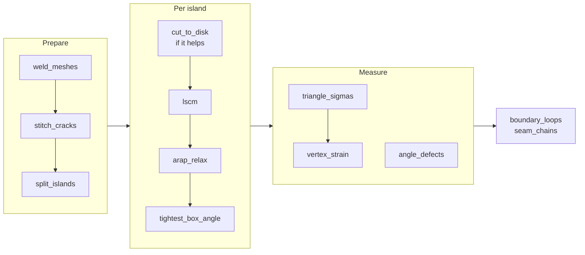

# The Flatten Surface solver

How `commands/flattensurface/flatten.py` turns a pile of tessellated faces into a
flat pattern with a strain map, and why each stage is there.

[← Developer guide](index.md) ·
[Architecture note](../arch/Flatten%20Surface.md) ·
[User guide](../Flatten%20Surface.md) ·
[Method background and sources](Flatten%20Surface%20research.md)

The module imports no `adsk`. It takes `(x, y, z)` tuples in centimetres, already
resolved to root space, and returns 2D tuples in centimetres plus per-vertex
strain. That is the whole reason it can be developed and tested without Fusion —
`tests/test_flattensurface_flatten.py` and `_cracks.py` load it straight off disk.

## The problem in one paragraph

Flattening is **mesh parameterization**. A surface is developable — flattenable
with no distortion — exactly when it is *intrinsically flat*: when the triangle
angles meeting at every interior vertex add to a full turn. Planes and cylinders
qualify, and so does any number of them joined edge to edge. A dome does not, and
no algorithm can make it, so the honest output is a layout that spreads the error
sensibly plus an measurement of what the error is.

## Pipeline



## Preparing the mesh

### `weld_meshes`

Fusion tessellates each face separately, so a shared edge arrives as two rows of
coincident nodes. Welding is what turns a selection into one connected patch.
A spatial hash on a grid of cell size `tol` probes the 27 neighbouring cells, so
two nodes either side of a cell boundary still merge. `tri_source` records which
selected face each triangle came from, which is what makes seam detection possible
later.

### `stitch_cracks`

Welding only joins nodes that actually coincide. Where two faces sample a shared
edge *differently*, one side's vertices sit stranded partway along the other
side's triangles and the patch ends up hinged rather than joined.

```
face A (coarse)        face B (fine)          after stitching
   x-------x              x                      x---x---x
   |       |              |                      |   |   |
   |       |              x                      x---x---x
   |       |              |                      |   |   |
   x-------x              x                      x---x---x
        two free rims, joined only at the ends
```

Nothing downstream notices this on its own: the patch still reports one island,
no flipped triangles, and matching 3D and 2D areas. What it does is flatten at
about 14% strain where the same shape meshed evenly gives 0%, and leave a second
boundary loop that the sketch draws as a hole which is not in the model.

Each stranded vertex is welded in by re-cutting the triangle that spans it.
Adding points along a triangle's edges leaves a **convex** polygon, so a fan from
an untouched corner always retriangulates it correctly. Each new triangle
inherits its parent's `tri_source`.

The tolerance is deliberately looser than the weld tolerance: two faces meeting
along a straight edge agree exactly, but along an arc each approximates the curve
its own way, so their points sit *near* the other's chords rather than on them.

### `cut_to_disk`

A patch must be a topological disc to have a flat form. A closed tube is an
annulus and has none until it is slit — the paper-towel-roll problem. The seam is
the shortest run of mesh edges between the two boundaries; every vertex along it
is duplicated and the triangles on one side are moved onto the duplicates, which
opens the surface without moving or losing any geometry.

Choosing which side is "one side" has to be consistent along the whole seam or
the cut zigzags. Anchoring on the directed half-edge does that: the triangle
containing `v_i -> v_i+1` is on the same side at every vertex, which the fan walk
in `_fan_forward` / `_fan_backward` relies on.

**Topology does not decide whether to cut.** A washer is an annulus in exactly
the same sense as a tube, and slitting one is as wrong as failing to slit the
other. `rings_a_hole()` separates them by **boundary turning**: a rim that goes
round a hole turns through a full `2*pi`, while a tube end is a geodesic and
turns through nothing, because the surface carries straight on past it.

| Shape | Boundary turning | Cut? |
|---|---|---|
| Tube (closed cylinder) | 0.00 pi | yes |
| Cone wall | 0.89 pi | yes |
| Flat washer | 2.00 pi | **no** |
| Formed washer, domed or waved | 2.06 pi | **no** |
| Any disc | one boundary only | not attempted |

Anything that rings a hole keeps it, whatever the strain, and the cut is only
then judged on whether it lowers distortion. Erring towards keeping the hole is
deliberate: a ring flattened without a cut carries strain that is reported and
can be judged, while a hole slit by mistake unrolls into a spiral that is
unusable and not obviously wrong at a glance.

A closed shell such as a sphere has no boundary to run a seam between and is not
handled.

## Laying it flat

### `lscm` — least-squares conformal map

One sparse linear least-squares solve. The conformal energy is assembled as
dict-of-dicts sparse rows and solved with a Jacobi-preconditioned conjugate
gradient (`solve_cg`) — there is no numpy here, so the solver is hand-rolled. Two
boundary vertices are pinned to fix the otherwise-free similarity; the farthest
apart are chosen so the pinning conditions the system as well as possible.

LSCM preserves angles and pushes all the error into area, which makes it a good
starting layout and a poor final one for fabrication.

### `arap_relax` — as-rigid-as-possible

Alternates two steps for a fixed number of sweeps:

- **local** — per triangle, the best-fit rotation in closed form. No SVD library
  is needed for a 2x2.
- **global** — one cotangent-Laplacian solve, the matrix assembled once and
  reused across every sweep.

Cotangent weights go negative on obtuse triangles, which can make the system
indefinite and stall the solve; `MIN_COTAN` clamps them to a small positive floor,
trading a little accuracy on badly-shaped triangles for a system that stays
symmetric positive definite.

Relaxation balances the error between angle and area, which is what a cut pattern
usually wants. It typically halves the average strain on a doubly-curved face.

### `tightest_box_angle`

A conformal map fixes orientation arbitrarily, so a plain rectangular panel
routinely lands at 45 degrees. The minimal bounding box always has a side flush
with an edge of the convex hull (rotating calipers), so only the hull edges need
testing rather than a sweep of angles. Four rotations share that box; the
landscape one is chosen, because a pattern that lands portrait one time and
landscape the next is a nuisance to nest and to compare.

## Measuring

### `triangle_sigmas` — strain from the Jacobian

Everything measured derives from the singular values of each triangle's 3D-to-2D
Jacobian. Build an orthonormal frame in the triangle's own plane, solve the 2x2
system mapping its 3D edge vectors to its 2D ones, then with
`a = J11² + J21²`, `b = J11·J12 + J21·J22`, `c = J12² + J22²`:

```
sigma = sqrt( ( (a + c) ± sqrt( (a - c)² + 4b² ) ) / 2 )
```

Closed form, no library. From those:

| Quantity | Expression | Meaning |
|---|---|---|
| Area ratio | `s1 · s2` | 2D area over 3D area |
| Signed strain | `sqrt(s1 · s2) − 1` | What the map shows, as a percentage |
| Shear | `s1 / s2` | Angle distortion; 1 is conformal |

`vertex_strain` area-weights the per-triangle values onto vertices for smooth
shading, and counts flipped triangles by signed 2D area — a fold is a real defect
and is reported rather than hidden.

### `angle_defects` — what cannot be fixed

`2π` minus the angles meeting at each interior vertex. Zero everywhere means the
patch is intrinsically flat and *will* flatten exactly. Anything else is curvature
no algorithm can remove.

```
        box corner: three faces, three right angles

              90° + 90° + 90° = 270°
              2π − 270° = 90° of defect
```

Boundary vertices are excluded — they are meant to fall short of a full turn.

This is what separates "the pattern is bad because of a defect" from "the pattern
is bad because the shape is". Cracks show up as T-junctions and an extra boundary
loop with **zero** defect; a genuine corner shows defect with **no** cracks. They
never look alike, which is why the dialog can report them separately.

### `strain_limit` — the colour scale floor

The scale fits itself to the data so the colours show where distortion sits. It
must not shrink without bound: on a surface that flattens exactly the only thing
left in the data is solver residue around `1e-7`, and a scale fitted to that
paints rounding error at full saturation. `MIN_STRAIN_LIMIT` stops it at a tenth
of a percent, and `is_measurable()` is the matching predicate the UI uses to
suppress the Min/Max markers and say "Flattens exactly" instead of quoting zeroes.

## Recognising geometry in the outline

A traced boundary is a polyline, but the shape it came from is not. `bolt hole`
means circle, `fillet` means arc, `machined edge` means line, and a sketch full
of splines loses all of that.

`segment_curve()` walks the chain greedily: from each start it extends a line as
far as it fits, extends a circle the same way, and takes whichever reaches
further. `fit_circle()` is the algebraic (Kasa) fit — one 3x3 solve, reduced to
2x2 by centring on the centroid, with no iteration.

### Fitting is not the hard part

Anything can be covered by enough short primitives that each pass a tolerance
test, and doing so produces geometry nobody wants — a smooth outline faceted
into chords. The test that separates the two cases is **how well** a primitive
fits, not whether it fits:

| Outline | Deviation of the fitted primitives |
|---|---|
| Extruded stadium, developable | 1e-6 cm — **0.0% of tolerance** |
| Torus patch, doubly curved | 33% to 100% of tolerance |

Genuine geometry is exact. The mesh points on a machined edge really are
collinear and the points around a bolt hole really do lie on a circle, so the fit
lands at solver precision. A chord laid across a curve merely fits. So a
primitive is kept only when its deviation is within `PRIMITIVE_FIT_FRACTION` of
the tolerance; everything else is gathered back into a spline.

That threshold applies to **acceptance, not to how far a primitive may reach**.
Tightening the extension instead is the obvious move and it makes things worse:
primitives simply become shorter, and a dense boundary shatters into more pieces
rather than fewer. Measured on the same torus patch, at three mesh densities:

| Approach | Entities in the outline |
|---|---|
| Fit to full tolerance | 6, 8, 15 — and worsening with mesh density |
| Tighten the extension | 14, 11, 15 |
| **Tighten acceptance** | **4, 4, 4** |

The last row is the point: the answer should not move when the mesh is refined.

One more guard, for a different failure: a circle fit whose radius exceeds
`MAX_ARC_RADIUS_SPANS` times the run's own span is the straight line it really
is. Without it a flat edge is drawn as a vast shallow arc, which no tolerance
check would catch. And a primitive must still cover `MIN_PRIMITIVE_POINTS` chain
points **or** reach `MIN_PRIMITIVE_SPANS` times the local spacing, which saves a
flat edge the tessellator left as one long two-point segment.

Worked results, all pinned by `tests/test_flattensurface_segments.py`:

| Input | Output |
|---|---|
| Circle, 40 points | one `circle` |
| Rectangle | four `line` |
| Stadium (extruded profile, filleted ends) | `arc`, `line`, `arc`, `line` |
| S of two tangent fillets | two `arc` |
| Sine wave | one `spline` |
| Ellipse | one `spline` |
| Torus patch, any mesh density | four `spline`, one per edge |

Cost is why this runs on the unthinned chain: a 400-point circle segments in well
under a millisecond, a 450-point mixed boundary in about 9 ms. Thinning first
would be faster but destroys the evidence the size tests depend on — a thinned
straight edge is two points and looks exactly like a sliver.

## Performance envelope

Pure Python, so triangle count is everything. Roughly:

| Triangles | Solve |
|---|---|
| ~1 000 | well under a second |
| ~4 000 | about a second — the working budget |
| ~10 000 | order of ten seconds |

`entry.py` coarsens the mesh rather than let the dialog hang, and says so. The
conjugate-gradient solver caps its iterations too: a warning beats a freeze.

## Working on it offline

The solver runs anywhere Python does, which is the fastest way to change it.
`cache/flatten_diagnostics.py` prints strain for a set of analytic shapes, and
`cache/tube_probe.py` covers the topology cases. Both write nothing but an SVG
sample, and `cache/` is git-ignored.

Useful shapes to reason with, all buildable in a few lines:

| Shape | Expected |
|---|---|
| Flat grid | zero strain, unchanged |
| Cylinder patch | zero strain — developable |
| Extruded rounded rectangle | zero strain across planes *and* cylinders |
| Closed tube | zero strain after one cut; width is the **polygon** perimeter, not the circle's |
| Flat washer | zero strain, no cut, hole preserved |
| Box corner | exactly 90° of defect, non-zero strain |
| Sphere cap | rim stretches relative to centre |

The tube case is worth stating precisely: a 24-sided prism unrolls to
`2 · 24 · r · sin(π/24)`, not `2πr`. The mesh is what gets flattened, so matching
the circle would mean the solver was wrong.

---

*Copyright © 2026 IMA LLC. All rights reserved.*
